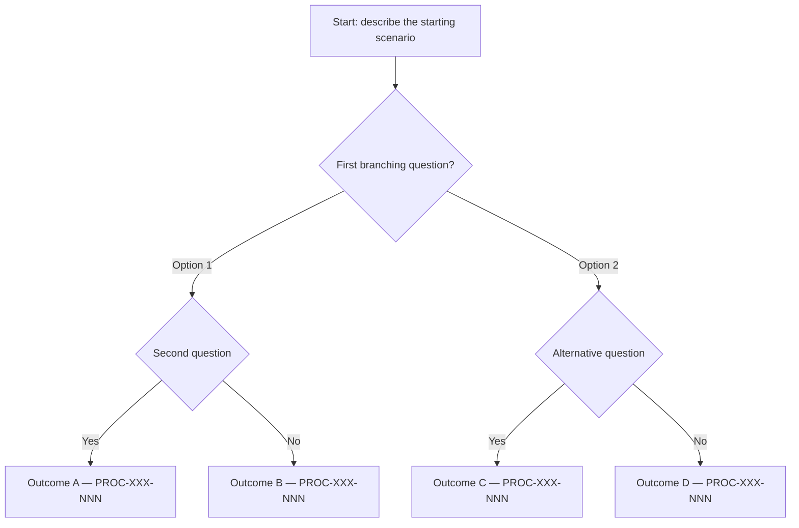

# [Decision Tree Title]

## Purpose

[What decision does this tree help make? Who uses it and when? What is the output — a process recommendation, a yes/no eligibility answer, a route to a specific service?]

---

## Inputs Required

What must be known before using this tree:

- [Input 1 — e.g. client's nationality (EU or non-EU)]
- [Input 2 — e.g. basis for presence in Cyprus (employed, self-sufficient, student)]
- [Input 3 — e.g. income type and source]
- [Input 4 — e.g. whether they have dependants]

---

## Decision Tree Diagram

---

## Branch Explanations

### Branch: [Branch name — mirrors diagram label]

[Narrative explanation of why this path leads to this outcome. What qualifies a client for this route. Any conditions that must be met. Common misconceptions about this branch.]

### Branch: [Next branch name]

[Explanation...]

---

## Edge Cases and Exceptions

[Situations where the standard tree does not apply cleanly, where answers may be ambiguous, or where an advisor must assess before routing:]

- **[Edge case 1]:** [What to do]
- **[Edge case 2]:** [What to do]

---

## Outcomes Summary

| Outcome | Route | Process Doc | Notes |
|---------|-------|-------------|-------|
| [A] | [Route name] | PROC-XXX-NNN | [Any caveat] |
| [B] | [Route name] | PROC-XXX-NNN | [Any caveat] |
| [C] | [Route name] | — forthcoming | [Any caveat] |

---

## Related Decision Trees

- [Link to related tree](related-tree.md)

---

*Decision trees are routing tools for initial assessment. They do not replace professional advice. Clients with complex or multi-jurisdiction situations should speak to an advisor before acting on the output.*
