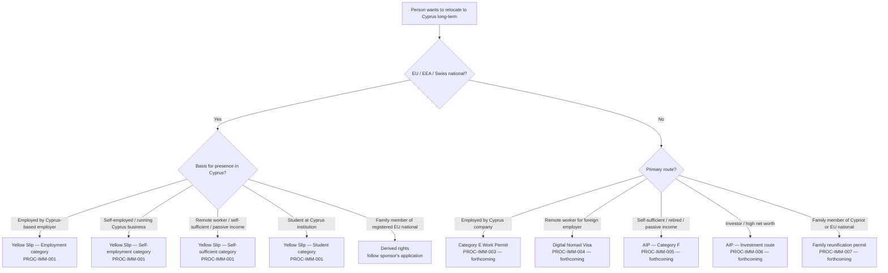

# Residency Route Selector

## Purpose

Helps an advisor (or a client doing initial research) identify the correct Cyprus residency route based on nationality, employment situation, and income type. The output is a recommended process to follow — not a determination of eligibility. Full eligibility assessment requires an advisor consultation.

---

## Inputs Required

What must be known before using this tree:

- **Nationality** — EU/EEA/Swiss national, or non-EU national
- **Employment basis** — employed by a Cyprus employer, self-employed in Cyprus, remote worker for a foreign employer, or no active employment (self-sufficient / retired)
- **Income source** — salary, business income, passive income (dividends, pension, rental), or a combination
- **Whether they have dependants** — spouse, children — as they may require separate or derived applications
- **Intended length of stay** — short-term visit vs. long-term residency

---

## Decision Tree Diagram

---

## Branch Explanations

### Branch: EU National → Employed by Cyprus employer

The client holds an employment contract with a Cyprus-registered employer. This is the simplest EU national route — the employer's registration and the client's contract together satisfy the economic activity requirement for the Yellow Slip. The client applies at the local CRMD office.

Note: the *category* on the Yellow Slip application changes depending on employment status, but the process document (PROC-IMM-001) covers all EU national categories.

### Branch: EU National → Self-employed / running Cyprus business

The client operates a Cyprus-registered sole trader, partnership, or company. They must show active business registration and evidence of economic activity in Cyprus. This route requires more preparation than the employed category but follows the same CRMD process.

### Branch: EU National → Remote worker / self-sufficient / passive income

The client lives in Cyprus but works remotely for a foreign employer, earns passive income (dividends, rental income, pension), or is otherwise self-sufficient. They must demonstrate sufficient financial means and have comprehensive health insurance (private policy or GESY registration). This is the most common route for Paphos Advisors' ICP segments.

There is no officially published minimum income threshold for this category. Practitioners cite €1,000–€1,500/month net as the practical benchmark, but this varies by CRMD office and officer.

### Branch: EU National → Student

The client is enrolled full-time at a Cyprus educational institution. The institution typically assists with the registration process. Less common in the Paphos Advisors client base.

### Branch: EU National → Family member of registered EU national

The client is a spouse or dependant of an EU national who is already registered (or applying simultaneously). They derive their right to reside from the sponsor and apply together or sequentially. Their application mirrors the sponsor's category.

### Branch: Non-EU → Employed by Cyprus company

The client has a job offer from a Cyprus-registered employer who sponsors the work permit application. This is a more complex process involving both the employer (permit application) and the client (ARC registration). Processing times are longer than for EU nationals.

### Branch: Non-EU → Remote worker for foreign employer

The client works remotely for a company based outside Cyprus and does not have a Cyprus employment contract. Cyprus introduced a Digital Nomad Visa for this category. This is a time-limited permit (renewable) rather than permanent residency.

### Branch: Non-EU → Self-sufficient / retired / passive income

The client has sufficient passive income (pension, dividends, rental income) and does not work in Cyprus. The AIP Category F route applies. Minimum income thresholds apply and are higher than for EU nationals.

### Branch: Non-EU → Investor / high net worth

The client intends to make a qualifying investment in Cyprus (real estate, business, government bonds). The AIP investment route offers faster processing and a path to permanent residency. Minimum investment thresholds apply.

---

## Edge Cases and Exceptions

- **Dual nationality (EU + non-EU):** Always treat as EU national for Cyprus residency purposes. The EU nationality takes precedence.
- **Non-EU spouse of EU national:** The non-EU spouse has derived rights under EU free movement law and follows the EU national's application — they do not apply as a non-EU national independently.
- **EU national who has been resident for 5+ years:** May be eligible for the Certificate of Permanent Residence (MEU3) rather than the initial Yellow Slip. Confirm length of continuous residence before routing.
- **Client who is also seeking Cyprus tax residency (60-day rule or non-dom):** Residency route and tax residency are separate processes with separate eligibility criteria. Do not conflate. Refer to the Tax Residency Eligibility decision tree for the tax question.
- **Client recently left another EU member state:** Check whether they held residency documents in that state — this may affect their timeline or documentation requirements in Cyprus.
- **Non-EU national already in Cyprus on a tourist visa:** They cannot convert a tourist visit into residency in Cyprus — they must typically return to their home country and apply from there, or apply via an AIP route that permits in-country processing. Verify current rules before advising.

---

## Outcomes Summary

| Outcome | Route | Process Doc | Status |
|---------|-------|-------------|--------|
| EU — Employed | Yellow Slip (Employment category) | PROC-IMM-001 | Available |
| EU — Self-employed | Yellow Slip (Self-employment category) | PROC-IMM-001 | Available |
| EU — Self-sufficient / remote | Yellow Slip (Self-sufficient category) | PROC-IMM-001 | Available |
| EU — Student | Yellow Slip (Student category) | PROC-IMM-001 | Available |
| EU — Family member | Derived rights | PROC-IMM-001 (sponsor) | Available |
| Non-EU — Employed | Category E Work Permit | PROC-IMM-003 | Forthcoming |
| Non-EU — Remote worker | Digital Nomad Visa | PROC-IMM-004 | Forthcoming |
| Non-EU — Self-sufficient | AIP Category F | PROC-IMM-005 | Forthcoming |
| Non-EU — Investor | AIP Investment | PROC-IMM-006 | Forthcoming |
| Non-EU — Family | Family reunification | PROC-IMM-007 | Forthcoming |

---

## Related Decision Trees

- [Tax Residency Eligibility](tax-residency-eligibility.md) — once residency route is confirmed, use this tree to assess 60-day rule and non-dom eligibility

---

*Decision trees are routing tools for initial assessment. They do not replace professional advice. Clients with complex or multi-jurisdiction situations should speak to an advisor before acting on the output.*
