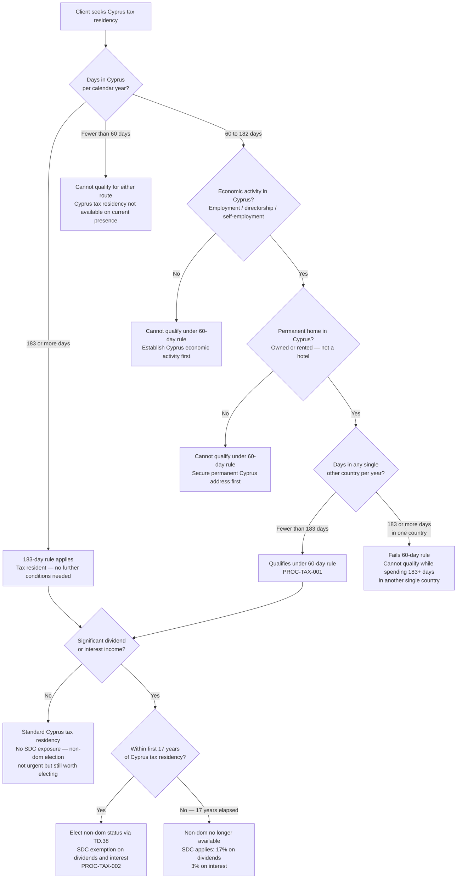

# Cyprus Tax Residency Eligibility

## Purpose

Helps an advisor assess whether a client can establish Cyprus tax residency, which rule applies (183-day or 60-day), and whether they should subsequently elect non-domicile (non-dom) status. The output is a recommended route and any follow-on actions.

Tax residency and immigration residency are separate — a client may have immigration residency (Yellow Slip) without being Cyprus tax resident, and vice versa. This tree covers tax residency only.

---

## Inputs Required

What must be known before using this tree:

- **Days in Cyprus per calendar year** — actual or intended
- **Days in any single other country per year** — to assess the 183-day condition under the 60-day rule
- **Whether they have a permanent home in Cyprus** — own or rented property in their name (not a hotel)
- **Whether they have economic activity in Cyprus** — employment contract, directorship of a Cyprus company, or self-employment registered in Cyprus
- **Income type** — salary/business income vs. dividend and interest income (relevant for non-dom assessment)
- **How many years they have been Cyprus tax resident** — relevant for the 17-year non-dom clock

---

## Decision Tree Diagram

---

## Branch Explanations

### Branch: 183-day rule

The client spends 183 or more days in Cyprus in a calendar year. No other conditions apply — they are automatically Cyprus tax resident under the standard rule. This is the simpler of the two routes and requires no economic activity or permanent home test.

Days are counted per calendar year (1 January to 31 December). The day of arrival and departure are both counted as Cyprus days.

### Branch: 60-day rule — qualifies

The client spends between 60 and 182 days in Cyprus and meets all three additional conditions:

1. **Economic activity** — employed by a Cyprus employer, director of a Cyprus-registered company, or self-employed and registered in Cyprus. A directorship of a Cyprus company (even without salary) is the most common way to satisfy this condition.
2. **Permanent home** — owns or rents a property in Cyprus in their own name. A hotel stay does not qualify. A property rented via a lease agreement in the client's name does.
3. **No more than 182 days in any single other country** — the client must not spend 183 or more days in any one other country during the same calendar year.

**2026 reform:** From 1 January 2026, the previous condition that the client must *not be tax resident anywhere else* was removed. Clients who are also tax resident in another jurisdiction can now qualify for Cyprus tax residency under the 60-day rule. This is a significant change that opens the route to more clients.

Travel records are critical for this route. Clients should maintain a contemporaneous diary of their movements throughout the year — not reconstruct it at year-end.

### Branch: Cannot qualify — fewer than 60 days

The client does not spend enough time in Cyprus to qualify under either rule. Cyprus tax residency is not available on current presence. Options are: increase time in Cyprus to reach 60 days (and establish economic activity), or reconsider whether Cyprus tax residency is the right goal.

### Branch: Cannot qualify — no economic activity

The client spends 60–182 days in Cyprus but has no Cyprus employment, directorship, or registered self-employment. The simplest solution is to establish a Cyprus company and take a directorship. Specialist tax advice is required before acting.

### Branch: Cannot qualify — 183+ days in one other country

The client spends 60+ days in Cyprus but also spends 183 or more days in a single other country. They fail the 60-day rule and would typically become tax resident in that other country instead. The client needs to reduce time in that country below 183 days or reconsider their situation.

### Branch: Non-dom — elect

The client qualifies for Cyprus tax residency and has significant dividend or interest income. Non-dom status exempts them from Special Defence Contribution (SDC) on those income types. SDC rates without non-dom: 17% on dividends, 3% on interest. Non-dom election is made annually via the TD.38 declaration filed with the tax return.

**Important caveats:**
- Non-dom status does not exempt from GHS (General Healthcare System) contributions: 2.65% on dividend and interest income, capped at €180,000. This is commonly overlooked.
- The 17-year clock runs from the first year of Cyprus tax residency — not from when non-dom status was first elected. Years of Cyprus tax residency without a non-dom election still count against the clock.
- A proposed €5,000–€10,000 flat annual fee for non-dom applicants was under discussion as of April 2026 but had not been enacted. Monitor for updates.

### Branch: Non-dom — 17 years elapsed

The client has been Cyprus tax resident for 17 or more years. Non-dom status is no longer available. SDC applies at the standard rates. Specialist tax planning advice is required.

---

## Edge Cases and Exceptions

- **Client is also seeking immigration residency (Yellow Slip):** These are separate processes. Immigration residency does not automatically create tax residency, and tax residency does not require immigration residency. Both may be pursued simultaneously but via different applications.
- **Client was previously Cyprus tax resident, left, and is returning:** The 17-year non-dom clock continues from the original first year of Cyprus tax residency — it does not reset on return. Verify historical records before advising on non-dom eligibility.
- **Client is employed by a foreign employer but works remotely from Cyprus:** The economic activity condition for the 60-day rule requires Cyprus-based activity (Cyprus employer, Cyprus company directorship, or Cyprus-registered self-employment). Working for a foreign employer remotely from Cyprus does not satisfy the condition. A Cyprus company structure is typically required.
- **Days calculation disputes:** Tax authorities may challenge day counts if travel records are poor. Advise clients to keep boarding passes, hotel receipts, and a dated travel diary. Do not rely on bank transaction history alone.
- **Client with income in multiple jurisdictions:** Multi-jurisdiction tax situations require specialist cross-border tax advice. Do not route these clients through this tree alone — the interaction between Cyprus tax residency and other jurisdictions' tie-breaker rules (under double tax treaties) requires professional assessment.
- **Proposed non-dom flat fee:** If enacted, this would change the economics of non-dom for lower-income clients. Monitor government announcements and update this tree and PROC-TAX-002 when confirmed.

---

## Outcomes Summary

| Outcome | Route | Process Doc | Status |
|---------|-------|-------------|--------|
| 183+ days in Cyprus | 183-day rule — automatic tax residency | PROC-TAX-001 | Available |
| 60–182 days, all conditions met | 60-day rule — elective tax residency | PROC-TAX-001 | Available |
| Tax resident + dividend/interest income, <17 years | Non-dom election | PROC-TAX-002 | Available |
| Tax resident + no significant passive income | Standard Cyprus tax residency | PROC-TAX-001 | Available |
| <60 days or conditions not met | Not eligible — no route available | — | — |
| 17+ years Cyprus tax resident | Non-dom not available — SDC applies | PROC-TAX-002 (for context) | — |

---

## Related Decision Trees

- [Residency Route Selector](residency-route-selector.md) — use first to confirm immigration residency route before addressing tax residency

---

*Decision trees are routing tools for initial assessment. They do not replace professional advice. Clients with multi-jurisdiction tax situations must consult a qualified Cyprus tax specialist before acting.*
