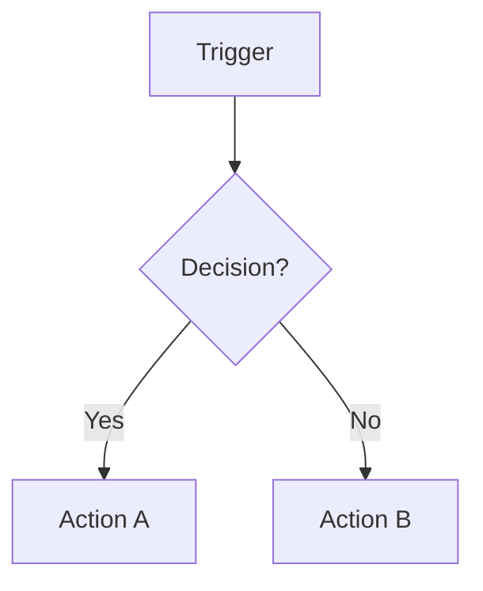

# [SOP Title]

## Purpose

<!-- Why this SOP exists and what problem it solves. 2–3 sentences. Write for a new team member on day one. -->

---

## Scope

<!-- What this SOP covers and what it explicitly does not cover.
- Which roles this applies to
- Which situations or tasks it covers
- What it does NOT cover (to avoid confusion with another SOP) -->

---

## Roles and Responsibilities

| Role | Responsibility |
|------|----------------|
| [Role] | [What they do in this SOP] |
| [Role] | [What they do in this SOP] |

---

## Inputs

<!-- What must exist before this SOP begins. Include:
- The trigger event or condition that starts this SOP
- Artefacts, records, or approvals that must be in place
- Prior SOPs that must have been completed -->

---

## Process Steps

<!-- Numbered steps in the exact order they must be completed. For each step:
- Who: the role performing the step
- How: precise instructions
- Output: what is produced
- Tool: where in Notion / GitHub / CMS this happens

Steps should be granular enough that someone unfamiliar with the task could follow them without asking questions. -->

### Step 1: [Action]
- **Who:** [Role]
- **How:** [Precise instructions]
- **Output:** [What is produced]
- **Tool:** [Notion / GitHub / CMS / etc.]

### Step 2: [Action]
- **Who:**
- **How:**
- **Output:**
- **Tool:**

---

## Decision Points

<!-- Conditions that change the flow. Add a Mermaid diagram where helpful. -->

---

## Outputs

<!-- What is produced when this SOP completes successfully. For each output:
- What it is (document, record, status change, notification)
- Where it lives (Notion, GitHub, etc.)
- Who receives it or needs to be notified -->

---

## Quality Gates

<!-- Explicit pass/fail criteria. A reviewer must be able to answer yes or no to each item.
Use a checklist format. -->

- [ ] [Gate 1]
- [ ] [Gate 2]
- [ ] [Gate 3]

---

## Exceptions and Escalations

<!-- Known situations where this SOP cannot be followed as written, and what to do instead.

**Exception:** [Describe the situation]
**How to handle:** [What to do instead or in addition]

If no known exceptions: "No exceptions at this time." -->

---

## Related Documents

<!-- Links to related SOPs, workflows, templates, and reference files. -->

- [Related SOP](../[area]/[sop-slug].md)
- [Related Workflow](../../workflows/[pipeline]/[lifecycle].md)
