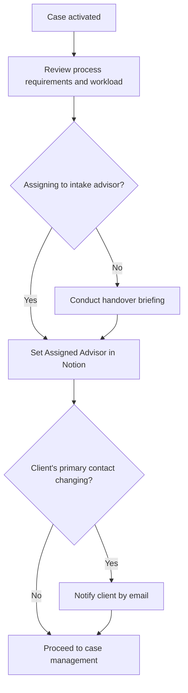

# Case Assignment SOP

## Purpose

Defines how active cases are assigned to advisors and how workload is managed. Currently all cases are assigned to Jason as the sole advisor. This SOP is structured to scale when the team grows.

---

## Scope

Covers assignment of cases that have reached `Active` status following intake (SOP-CAS-001). Covers both initial assignment and mid-case reassignment. Does not cover intake (SOP-CAS-001) or escalation (SOP-CAS-003).

---

## Roles and Responsibilities

| Role | Responsibility |
|------|----------------|
| Lead Advisor (Jason) | Performs assignment. Currently receives all cases. Reviews workload. |
| Assigned Advisor | Takes responsibility for the case from assignment onwards. |

---

## Inputs

**Trigger:** A Case record reaches `Active` status in the Notion Cases database.

**Required before starting:**
- Case record exists in Notion with status `Active`
- Case Notes contain an initial assessment
- Processes required for the case have been tagged in the Case record

---

## Process Steps

### Step 1: Review the case at activation
- **Who:** Lead Advisor
- **How:** When a case is activated, review: what processes are required; the ICP segment; the client's timeline and urgency; current workload across the team. Identify which advisor is best placed.
- **Output:** Assignment decision made.
- **Tool:** Notion Cases database

### Step 2: Apply assignment criteria
- **Who:** Lead Advisor
- **How:** Assign based on: (1) process expertise — does the advisor know the processes this case requires; (2) current workload — how many active cases does each advisor hold; (3) ICP familiarity — has the advisor worked with this ICP segment before; (4) availability — given the client's timeline and urgency.
- **Output:** Criteria applied and rationale noted if assignment is non-obvious.
- **Tool:** Notion Cases database, workload view

### Step 3: Assign in Notion
- **Who:** Lead Advisor
- **How:** Set the `Assigned Advisor` field in the Case record to the chosen advisor.
- **Output:** Case assigned.
- **Tool:** Notion Cases database

### Step 4: Handover briefing (if assigning to another advisor)
- **Who:** Lead Advisor (outgoing), Assigned Advisor (incoming)
- **How:** If assigning to someone other than the intake advisor, conduct a brief verbal handover (10–15 minutes). Ensure the assignee has read the case notes and understands the client's situation, the scope agreed, and the next action.
- **Output:** Handover completed. Assignee confirms understanding.
- **Tool:** Direct communication, Notion case notes

### Step 5: Notify the client (if applicable)
- **Who:** Assigned Advisor
- **How:** If the client will be working with a different person from their initial contact, send a brief email introducing the assigned advisor by name and confirming the next steps.
- **Output:** Client notified.
- **Tool:** Email

---

## Decision Points

---

## Outputs

- `Assigned Advisor` field populated in Notion Case record
- Handover completed (if assignment is to a different advisor)
- Client notified of advisor change (if applicable)

---

## Quality Gates

- [ ] `Assigned Advisor` field set in Notion before case progresses
- [ ] Assignee has read case notes and confirmed understanding
- [ ] Client notified if assigned advisor differs from intake contact
- [ ] No case left unassigned for more than 24 hours after activation

---

## Exceptions and Escalations

**Exception:** A case requires expertise outside any current team member's knowledge.
**How to handle:** Assign to the most appropriate team member and arrange specialist partner support per SOP-CAS-003. Do not leave the case unassigned while seeking the right resource.

**Exception:** A team member needs to be reassigned mid-case (illness, capacity issue, expertise gap).
**How to handle:** Update the `Assigned Advisor` field in Notion immediately. Brief the new assignee. Notify the client. Do not leave any case without an assigned advisor for more than 24 hours.

**Exception:** Workload exceeds sustainable capacity.
**How to handle:** Flag to the lead advisor before accepting new cases. Do not accept cases that cannot be served to quality standard. Declining gracefully is better than accepting and underperforming.

---

## Workload Guidelines

| Advisor type | Maximum active cases |
|---|---|
| Lead Advisor (Jason) | To be established based on operational experience |
| Junior Advisor | To be set when first hired |

Review workload weekly. If any team member is above capacity, flag immediately rather than letting cases slip.

---

## Related Documents

- [Case Intake SOP](case-intake-sop.md)
- [Case Escalation SOP](case-escalation-sop.md)
- [Case Closure SOP](case-closure-sop.md)
- [Case Pipeline Lifecycle](../../workflows/case-pipeline/case-lifecycle.md)
