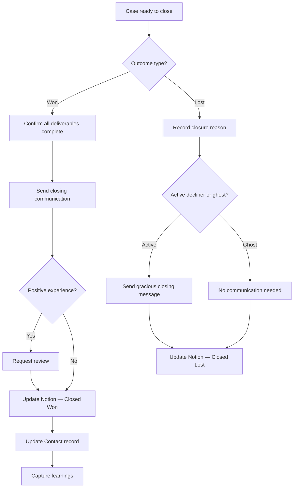

# Case Closure SOP

## Purpose

Defines how to close a case cleanly, capture learnings, and maintain the client relationship after engagement. Covers both successful closures and cases where the client did not proceed.

---

## Scope

Applies when all deliverables for a case have been completed, or when a client has decided not to proceed. Triggered from any active case status. Does not cover the escalation of active issues — those follow SOP-CAS-003 first.

---

## Roles and Responsibilities

| Role | Responsibility |
|------|----------------|
| Lead Advisor (Jason) | Executes all closure steps. Captures learnings. Updates all records. |
| Client | Receives final communication and documentation. |

---

## Inputs

**Triggers:**
- All deliverables in the Case record have been marked complete
- Client confirms they have received everything they need
- Client has decided not to proceed (lost)

**Required before starting:**
- Case is in an active status (not already closed)
- Case notes are up to date

---

## Process Steps

### Closure Type 1: Closed — Won

#### Step 1: Confirm all deliverables are complete
- **Who:** Lead Advisor
- **How:** Review the original scope agreed in the proposal. Confirm each item has been delivered and the client has received everything they need. Do not close prematurely.
- **Output:** All deliverables confirmed complete.
- **Tool:** Notion Cases database, original proposal

#### Step 2: Send a closing communication
- **Who:** Lead Advisor
- **How:** Send a closing message to the client summarising: what was achieved; any final documents or references they should keep; upcoming actions that are now their responsibility (e.g., annual tax returns, Pink Slip application after 5 years). Invite them to return for further help.
- **Output:** Closing communication sent.
- **Tool:** Email

#### Step 3: Request a review (where appropriate)
- **Who:** Lead Advisor
- **How:** If the client had a clearly positive experience and the case is fully resolved, this is the right moment to ask for a Google review or testimonial. Do not ask before the case is fully closed. Do not pressure.
- **Output:** Review request sent (or decision not to request noted).
- **Tool:** Email

#### Step 4: Update the Notion Case record
- **Who:** Lead Advisor
- **How:** Set Case status to `Closed — Won`. Set Date Closed to today. Record final notes in Case Notes. Confirm all partner referrals are logged with outcomes.
- **Output:** Case record closed and complete.
- **Tool:** Notion Cases database

#### Step 5: Update the Contact record
- **Who:** Lead Advisor
- **How:** Set Contact status to `Past Client`. Note any future needs the client mentioned (e.g., "Will need Pink Slip in 4 years"). Set a re-engagement reminder if appropriate.
- **Output:** Contact record updated.
- **Tool:** Notion Contacts database

#### Step 6: Capture learnings
- **Who:** Lead Advisor
- **How:** For cases involving unusual complexity, a knowledge gap, or a partner interaction: was any new information captured that should update process docs; did a partner perform exceptionally or poorly; did the client ask a question that revealed a content gap. Log learnings in the Research Log or create a content brief.
- **Output:** Learnings captured (or noted as no new learnings).
- **Tool:** Notion Research Log, Content Pipeline

---

### Closure Type 2: Closed — Lost

#### Step 7: Record the reason
- **Who:** Lead Advisor
- **How:** Record in Notion why the client did not proceed using one of: price / budget; chose competitor; changed plans; process too complex; no response / ghost. This data informs future ICP and service decisions.
- **Output:** Closure reason recorded.
- **Tool:** Notion Cases database

#### Step 8: Final communication (where appropriate)
- **Who:** Lead Advisor
- **How:** For clients who actively chose not to proceed: send a brief, gracious message. Leave the door open. Do not pressure. For ghost / no-response clients: no communication needed.
- **Output:** Final message sent (where appropriate).
- **Tool:** Email

#### Step 9: Update Notion records
- **Who:** Lead Advisor
- **How:** Set Case status to `Closed — Lost`. Set Date Closed. Note reason in Case Notes. Set Contact status to `Past Client` (not `Not a Fit` unless that is genuinely accurate).
- **Output:** Records updated.
- **Tool:** Notion Cases database, Contacts database

---

## Decision Points

---

## Outputs

**Closed — Won:**
- Case status set to `Closed — Won` with date
- Final communication sent
- Contact record updated to `Past Client`
- Partner referral outcomes confirmed in Case record
- Learnings captured in Research Log or Content Pipeline

**Closed — Lost:**
- Case status set to `Closed — Lost` with date and reason
- Contact record updated to `Past Client`
- Closure reason recorded for pipeline analysis

---

## Quality Gates

- [ ] All deliverables confirmed complete before closure (Won only)
- [ ] Closing communication sent
- [ ] Case status and Date Closed set in Notion
- [ ] Contact status updated to `Past Client`
- [ ] Partner referral outcomes recorded in Case notes (Won only)
- [ ] Closure reason recorded (Lost only)
- [ ] Learnings captured or explicitly noted as none (Won only)

---

## Exceptions and Escalations

**Exception:** A client returns after closure with an issue relating to the closed case.
**How to handle:** Reopen the Case record or create a new linked case. Do not add post-closure activity to a closed record — it obscures the closure state. Assess whether the issue was in scope or constitutes a new engagement.

**Exception:** A client asks for a review but then posts a negative review.
**How to handle:** Respond professionally and publicly. Do not delete or dispute unless the review is factually false. Investigate whether the complaint reveals a genuine gap and treat it as a complaint per SOP-CAS-003.

---

## Related Documents

- [Case Intake SOP](case-intake-sop.md)
- [Case Assignment SOP](case-assignment-sop.md)
- [Case Escalation SOP](case-escalation-sop.md)
- [Case Pipeline Lifecycle](../../workflows/case-pipeline/case-lifecycle.md)
