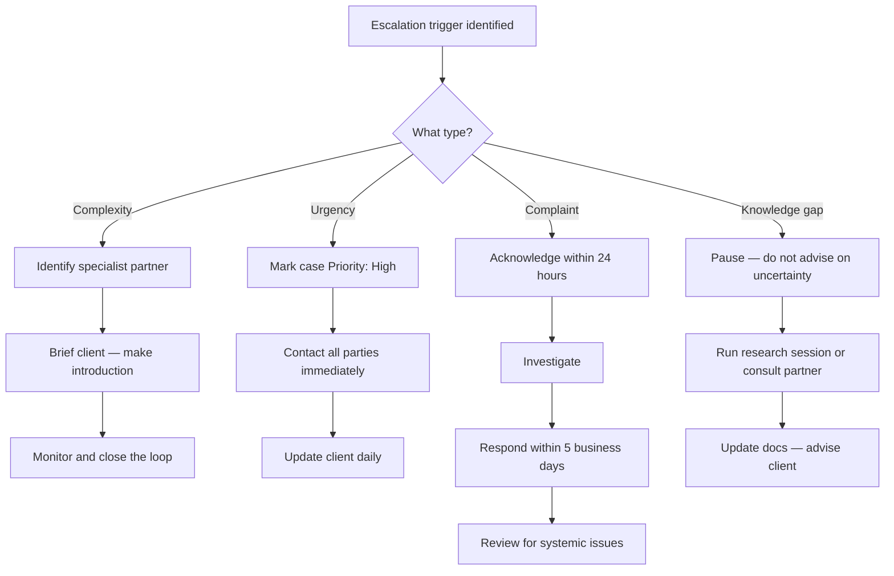

# Case Escalation SOP

## Purpose

Defines how to handle cases that go beyond normal scope — due to complexity, urgency, a client complaint, a partner failure, or a knowledge gap. Ensures escalations are handled promptly, transparently, and with the client's interests first.

---

## Scope

Covers all escalation types that may arise during an active case. Triggered within an existing case (SOP-CAS-001 through SOP-CAS-004). Does not initiate a new case — escalation is a response to conditions encountered during case management.

---

## Roles and Responsibilities

| Role | Responsibility |
|------|----------------|
| Lead Advisor (Jason) | Identifies and responds to all escalation triggers. Logs all escalations in Case record. |
| Specialist Partner | Provides expertise for cases outside Paphos Advisors' scope where required. |

---

## Inputs

**Triggers:**

| Trigger | Type |
|---|---|
| Process is outside our documented scope | Complexity |
| Client has a hard deadline (visa expiry, property completion, tax filing) | Urgency |
| Client received incorrect advice previously | Complexity |
| Client is unhappy with service quality | Complaint |
| A partner has made an error affecting a client | Partner failure |
| A regulatory change affects an active case mid-process | Regulatory |
| Conflicting official and field guidance creates unresolvable ambiguity | Knowledge gap |

**Required before starting:**
- Active case exists in Notion
- Escalation trigger has been identified

---

## Process Steps

### Escalation Type A: Specialist Referral (Complexity)

#### Step 1: Identify the specialist
- **Who:** Lead Advisor
- **How:** Identify the appropriate specialist (immigration lawyer, tax advisor, property agent) from the partner network. Confirm the specialist is `active` and appropriate for this client's ICP segment.
- **Output:** Specialist identified.
- **Tool:** Notion Partners database

#### Step 2: Brief the client
- **Who:** Lead Advisor
- **How:** Inform the client that you are bringing in specialist input and explain why. Do not create alarm — frame it as a proactive step to ensure they receive the best advice.
- **Output:** Client briefed.
- **Tool:** Email or phone

#### Step 3: Make the specialist introduction
- **Who:** Lead Advisor
- **How:** Make a warm introduction. Follow SOP-PAR-004 referral steps. Remain involved as the client's point of contact — do not hand the client over and disengage.
- **Output:** Introduction made. Referral logged.
- **Tool:** Email, Notion Cases database

#### Step 4: Monitor and close the loop
- **Who:** Lead Advisor
- **How:** Log the escalation in Case notes with date and reason. Follow up with the client after 2 weeks. Record the specialist's input and outcome in Case notes.
- **Output:** Escalation outcome recorded.
- **Tool:** Notion Cases database

---

### Escalation Type B: Urgency Protocol

#### Step 5: Mark case as high priority
- **Who:** Lead Advisor
- **How:** Set `Priority: High` in the Notion Case record. Set next action date to today or tomorrow.
- **Output:** Case flagged as high priority.
- **Tool:** Notion Cases database

#### Step 6: Contact all relevant parties immediately
- **Who:** Lead Advisor
- **How:** Contact the client, relevant partners, and any authorities as needed on the same day. Do not wait for regular response windows.
- **Output:** All parties contacted.
- **Tool:** Email, phone

#### Step 7: Update the client daily
- **Who:** Lead Advisor
- **How:** Provide a daily status update to the client until the urgency is resolved. Even if there is no new information, confirm that you are actively working on it.
- **Output:** Client informed daily.
- **Tool:** Email or phone

---

### Escalation Type C: Complaint Handling

#### Step 8: Acknowledge the complaint in writing
- **Who:** Lead Advisor
- **How:** Acknowledge the complaint within 24 hours by email. Do not become defensive in the acknowledgement. Confirm that you have received it and will respond with findings within 5 business days.
- **Output:** Complaint acknowledged in writing.
- **Tool:** Email

#### Step 9: Investigate
- **Who:** Lead Advisor
- **How:** Review what happened: what was communicated; what was in scope; where any expectation divergence occurred. Review Case notes, emails, and the original proposal.
- **Output:** Investigation complete. Root cause identified.
- **Tool:** Case notes, email history

#### Step 10: Respond to the complaint
- **Who:** Lead Advisor
- **How:** Respond within 5 business days with findings. If we made an error: acknowledge it clearly, apologise, and correct it. If the expectation was set incorrectly: explain what was in scope and agree a resolution. Do not deflect. Log the complaint and resolution in the Case notes.
- **Output:** Response sent. Resolution agreed.
- **Tool:** Email, Notion Cases database

#### Step 11: Review for systemic issues
- **Who:** Lead Advisor
- **How:** After the complaint is resolved, assess whether it reveals a systemic issue (unclear scope template, process documentation gap, partner quality failure). If yes, raise the appropriate follow-up action (process update, content update, partner review).
- **Output:** Systemic issues identified or cleared.
- **Tool:** Process docs, SOP-PAR-003 (if partner-related)

---

### Escalation Type D: Knowledge Gap Protocol

#### Step 12: Pause on the unknown point
- **Who:** Lead Advisor
- **How:** Do not guess or improvise on an unresolved knowledge gap. Tell the client you are confirming before advising. Note the gap in Case notes.
- **Output:** Knowledge gap logged. Client informed.
- **Tool:** Notion Cases database

#### Step 13: Resolve the knowledge gap
- **Who:** Lead Advisor
- **How:** Run a research session (SOP-RES-001) or consult a specialist partner. Update the relevant process doc or KB article with the confirmed information.
- **Output:** Knowledge gap resolved. Process docs updated.
- **Tool:** SOP-RES-001, GitHub process docs

#### Step 14: Advise the client and continue the case
- **Who:** Lead Advisor
- **How:** Once the gap is resolved with a reliable source, advise the client and log the research in the Research Log. Resume normal case management.
- **Output:** Client advised. Case progressed.
- **Tool:** Notion Research Log, Cases database

---

## Decision Points

---

## Outputs

- Escalation type and resolution logged in Case notes
- Specialist referral made and tracked (if applicable)
- Complaint acknowledged and resolved in writing (if applicable)
- Knowledge gap resolved and process doc updated (if applicable)
- Systemic issues identified and follow-up actions raised

---

## Quality Gates

- [ ] Escalation trigger identified and logged in Case notes with date
- [ ] Client informed of escalation and next steps on same day
- [ ] Complaint acknowledged in writing within 24 hours
- [ ] Complaint response provided within 5 business days
- [ ] Knowledge gap not advised upon until confirmed from a reliable source
- [ ] Process docs or KB articles updated if the gap revealed a documentation error
- [ ] Systemic issues reviewed after every complaint

---

## Exceptions and Escalations

**Exception:** A partner makes an error that causes material harm to a client.
**How to handle:** Prioritise the client's remediation first. Immediately assess whether the client needs a different specialist. Separately, trigger a partner review per SOP-PAR-003 and consider whether the commercial relationship should continue.

**Exception:** A complaint cannot be resolved within 5 business days due to ongoing investigation.
**How to handle:** Communicate a revised timeline to the client. Do not go silent. Interim updates are required even if findings are not yet complete.

---

## Related Documents

- [Case Intake SOP](case-intake-sop.md)
- [Case Assignment SOP](case-assignment-sop.md)
- [Case Closure SOP](case-closure-sop.md)
- [Partner Review SOP](../partners/partner-review-sop.md)
- [Referral Tracking SOP](../partners/referral-tracking-sop.md)
- [Research Capture SOP](../research/research-capture-sop.md)
- [Case Pipeline Lifecycle](../../workflows/case-pipeline/case-lifecycle.md)
