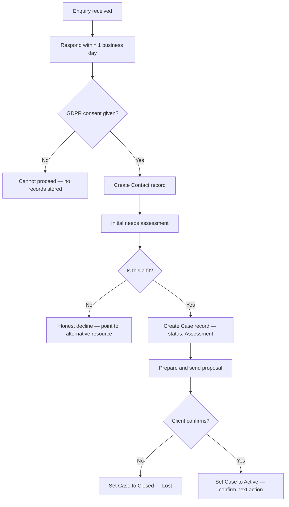

# Case Intake SOP

## Purpose

Defines how to handle a new client enquiry from first contact through to a confirmed engagement. Ensures all new enquiries are assessed fairly, GDPR obligations are met, and only appropriate cases are accepted.

---

## Scope

Covers the full intake journey: initial contact response, needs assessment, fit assessment, proposal, and confirmation of engagement. Ends when a Case record reaches `Active` status. Does not cover case management after activation (SOP-CAS-002), escalation (SOP-CAS-003), or closure (SOP-CAS-004).

---

## Roles and Responsibilities

| Role | Responsibility |
|------|----------------|
| Lead Advisor (Jason) | Handles all intake steps. Makes the fit and engagement decision. |
| Client / Prospect | Provides information about their situation and needs. |

---

## Inputs

**Trigger:** A new client enquiry is received via any channel (email, phone, referral, website form).

**Required before starting:**
- Enquiry received and noted
- No prior rejection record for this contact in Notion

---

## Process Steps

### Step 1: Respond to initial contact
- **Who:** Lead Advisor
- **How:** Respond to all new enquiries within 1 business day. Acknowledge receipt. Set expectations for when a full response will follow. Do not attempt a full needs assessment in the first response.
- **Output:** Acknowledgement sent.
- **Tool:** Email

### Step 2: Confirm GDPR consent
- **Who:** Lead Advisor
- **How:** Before storing any personal information, confirm GDPR consent is given. Record consent in the Contact record. If a prospect refuses consent, we cannot maintain their records or accept the case. Do not proceed without consent confirmed.
- **Output:** GDPR consent recorded.
- **Tool:** Notion Contacts database

### Step 3: Create a Contact record
- **Who:** Lead Advisor
- **How:** Create a record in the Notion Contacts database with: full name, email, phone, how they found us, referring partner (if applicable), first contact date, GDPR consent status.
- **Output:** Contact record created.
- **Tool:** Notion Contacts database

### Step 4: Initial needs assessment
- **Who:** Lead Advisor
- **How:** In the first substantive interaction, identify: current situation (nationality, location, family situation); what they are trying to achieve in Cyprus; their timeline; steps already taken. Use this to identify the likely ICP segment, relevant processes, and whether this is a case Paphos Advisors can help with.
- **Output:** Needs summary noted in Contact record.
- **Tool:** Notion Contacts database, process docs

### Step 5: Fit assessment
- **Who:** Lead Advisor
- **How:** Assess: do the processes they need fall within service scope; is their timeline realistic given current processing times; is their budget aligned with case complexity. Decision: fit or not a fit.

| Assessment | Action |
|---|---|
| Good fit | Proceed to create a Case record |
| Not a fit | Be honest; point to a more appropriate resource where possible; set status to `Not a Fit` in Notion with reason noted |

- **Output:** Fit decision made and recorded.
- **Tool:** Notion Contacts database

### Step 6: Create a Case record
- **Who:** Lead Advisor
- **How:** If the client is a fit, create a Case record in Notion linked to the Contact. Set status to `Assessment`. Assign the ICP segment. Tag the relevant processes required. Note the initial assessment in Case Notes.
- **Output:** Case record created at `Assessment` status.
- **Tool:** Notion Cases database

### Step 7: Prepare and send a proposal
- **Who:** Lead Advisor
- **How:** Prepare a clear scope of services covering: what we will do; what we will not do (critical for expectation management); timeline estimate; fee. Send the proposal to the client and set Case status to `Proposal Sent`.
- **Output:** Proposal sent. Case status updated.
- **Tool:** Email, Notion Cases database

### Step 8: Confirm engagement
- **Who:** Lead Advisor
- **How:** When the client confirms acceptance of the proposal, set Case status to `Active`. Confirm fee arrangement. Set the next action and due date in Notion.
- **Output:** Case active. Next action set.
- **Tool:** Notion Cases database

---

## Decision Points

---

## Outputs

- Contact record created in Notion with GDPR consent confirmed
- Case record created and set to `Active` status
- Scope of services and fee confirmed
- Next action and due date set

---

## Quality Gates

- [ ] GDPR consent confirmed before any personal data stored
- [ ] Contact record complete (all required fields)
- [ ] Fit assessment made and recorded — not assumed
- [ ] Proposal includes explicit scope (what we will and will not do)
- [ ] Case status reflects current stage accurately
- [ ] Next action set before closing this SOP

---

## Exceptions and Escalations

**Exception:** A prospect refuses GDPR consent.
**How to handle:** Do not store any data. Do not accept the case. A brief note without personal identifiers (e.g., "enquiry received, consent declined") may be kept for internal records only.

**Exception:** A prospect's situation is ambiguous and fit is unclear.
**How to handle:** Do not reject prematurely. Conduct a short discovery call (20–30 minutes) to understand the situation more fully. If still unclear after discovery, err on the side of declining gracefully rather than accepting a case you cannot serve well.

**Exception:** A partner makes an inbound referral but the client is not a fit.
**How to handle:** Decline the case using the same honest process. Notify the referring partner so they understand the outcome and can assist the client further if appropriate.

---

## Related Documents

- [Case Assignment SOP](case-assignment-sop.md)
- [Case Escalation SOP](case-escalation-sop.md)
- [Case Closure SOP](case-closure-sop.md)
- [Referral Tracking SOP](../partners/referral-tracking-sop.md)
- [Case Pipeline Lifecycle](../../workflows/case-pipeline/case-lifecycle.md)
