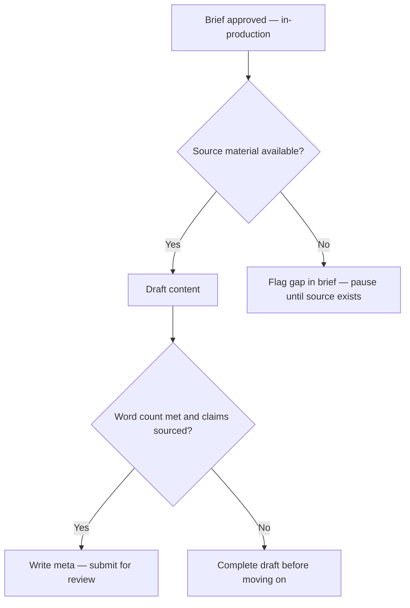

# Content Creation SOP

## Purpose

Defines the end-to-end process for creating a piece of content from brief to ready-for-review draft. Ensures all content is grounded in validated source material, meets editorial standards, and is ready for the review stage without rework.

---

## Scope

Covers the creation of any new piece of website content (guides, FAQs, checklists, comparison articles, partner profiles, news updates) from the point the brief is approved to the point the draft is submitted for review. Does not cover the review process (SOP-CON-002) or publishing (SOP-CON-003).

---

## Roles and Responsibilities

| Role | Responsibility |
|------|----------------|
| Content Author (Jason) | Executes all steps. Responsible for draft quality and source integrity. |
| Reviewer | Not part of this SOP — picks up at SOP-CON-002. |

---

## Inputs

**Trigger:** Content item moves to `in-production` status in the Notion Content Pipeline.

**Required before starting:**
- Content brief approved and linked in Notion Content Pipeline
- Related process doc(s) exist and are at least `draft` status
- Relevant KB articles available (or explicitly noted as not yet available)
- Content type, target ICP, and target keyword confirmed in the brief

---

## Process Steps

### Step 1: Read the brief
- **Who:** Content Author
- **How:** Open the content brief in Notion. Confirm: content type, target ICP(s), target keyword, related process doc, word count target.
- **Output:** Clear understanding of what is to be written and for whom.
- **Tool:** Notion Content Pipeline

### Step 2: Read the source material
- **Who:** Content Author
- **How:** Read in full: the related process document (`processes/[area]/[slug].md`), any related KB articles (`knowledge/`), the content type definition (`content-system/content-types/[type].md`), and the relevant style guide sections.
- **Output:** Working knowledge of the facts to be written from.
- **Tool:** GitHub

### Step 3: Check the topical map
- **Who:** Content Author
- **How:** Review `content-system/topical-map/` to confirm where this piece sits in the pillar/cluster structure, which existing pieces it should link to, and whether the angle has been covered elsewhere.
- **Output:** Internal linking targets identified. Anti-cannibalisation confirmed.
- **Tool:** GitHub

### Step 4: Draft the content
- **Who:** Content Author
- **How:** Use the appropriate page template from `content-system/templates/`. Write to the word count target. Every factual claim must be traceable to a KB article or process doc. Do not present field intelligence as official guidance. Add disclaimers where source confidence is medium or lower.
- **Output:** Complete draft at target word count.
- **Tool:** VS Code or preferred editor

### Step 5: Add internal links
- **Who:** Content Author
- **How:** Add at least 2 internal links per 1,000 words. Follow `content-system/rules/internal-linking-rules.md`. Only link to pages that exist.
- **Output:** Draft with internal links verified.
- **Tool:** Editor

### Step 6: Write meta title and description
- **Who:** Content Author
- **How:** Follow `content-system/rules/seo-rules.md` for character limits and keyword placement. Meta title: 50–60 chars. Meta description: 150–160 chars.
- **Output:** Meta title and description finalised.
- **Tool:** Editor

### Step 7: Save draft to GitHub and link in Notion
- **Who:** Content Author
- **How:** Save the completed draft as a Markdown file in the appropriate GitHub folder (e.g. `content/guides/[slug].md`). Copy the GitHub file URL. In the Notion Content Pipeline record, paste the URL into the `Content File` field. **Also paste the full draft text into the Notion page body itself** — the draft lives in both places, not just as a link.
- **Output:** Draft committed to GitHub. Notion record linked to the file, with the full text also readable directly in Notion.
- **Tool:** GitHub, Notion Content Pipeline

> **Field-naming note (2026-07-11):** the live Content Pipeline database has no field literally named "Content File." The field actually used for this link today is **"GitHub Content-Type Definition"** — a legacy name that, per the system's own ID registry, was meant for a different purpose (linking to `CT-DEF` writing-rules docs, not drafts). It's being reused for draft links in practice. Use that field until this is resolved; flagged as an open decision, not yet renamed. To find everything currently drafted, use the "Drafted Content (Ready to Reference)" saved view on the Content Pipeline database (filtered to Status: In Production/In Review/Revision/Approved/Scheduled/Published).

### Step 8: Update Notion status and notify reviewer
- **Who:** Content Author
- **How:** Set content item status to `in-review`. Note any open questions or caveats in the Notes field. Alert the assigned reviewer.
- **Output:** Content item status updated. Reviewer notified.
- **Tool:** Notion Content Pipeline

---

## Decision Points

---

## Outputs

- Complete content draft saved and linked in Notion brief
- Meta title and description written
- Content item status set to `review` in Notion
- Reviewer notified

---

## Quality Gates

- [ ] Word count within 10% of target
- [ ] All required sections present (per content type definition)
- [ ] No unattributed factual claims
- [ ] No official guidance presented from field sources only
- [ ] Disclaimer present where required (medium or lower confidence source)
- [ ] Meta title: 50–60 characters, includes primary keyword
- [ ] Meta description: 150–160 characters, includes call to action
- [ ] At least 2 internal links per 1,000 words, all resolving to existing pages

---

## Exceptions and Escalations

**Exception:** Source material does not exist for a required section.
**How to handle:** Write `[NEEDS SOURCE: describe what is needed]` in the draft. Do not invent or approximate. Flag in the brief. Do not submit for review until the gap is filled or explicitly approved as an acceptable gap.

**Exception:** Brief is unclear or contradictory.
**How to handle:** Do not proceed. Clarify the brief before starting. A unclear brief produces a draft that fails review.

---

## Related Documents

- [Content Review SOP](content-review-sop.md)
- [Content Publishing SOP](content-publishing-sop.md)
- [Content Pipeline Lifecycle](../../workflows/content-pipeline/content-lifecycle.md)
- [SEO Rules](../../content-system/rules/seo-rules.md)
- [Internal Linking Rules](../../content-system/rules/internal-linking-rules.md)
- [Editorial Standards](../../content-system/style-guide/editorial-standards.md)
