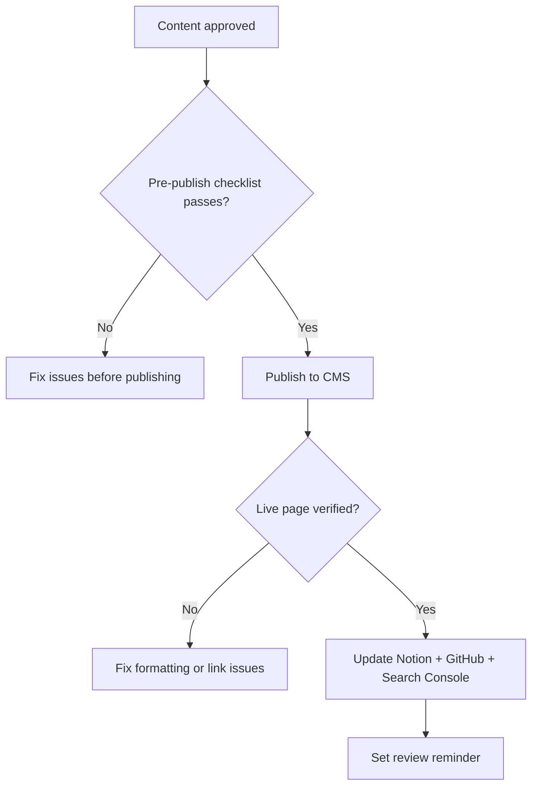

# Content Publishing SOP

## Purpose

Defines the steps to publish approved content to the website and update all related records. Ensures nothing is published without a final pre-publish check and that all downstream records (Notion, GitHub, Search Console) are updated after publishing.

---

## Scope

Covers the publishing of content that has reached `approved` status in the Content Pipeline — from final pre-publish verification through to post-publish indexing. Does not cover creation (SOP-CON-001), review (SOP-CON-002), or content updates to already-published pages (SOP-CON-004).

---

## Roles and Responsibilities

| Role | Responsibility |
|------|----------------|
| Publisher (Jason) | Executes all publishing steps and updates all records. |
| Reviewer | Has already approved the content before this SOP begins. Not involved in publishing. |

---

## Inputs

**Trigger:** Content item reaches `approved` status in the Notion Content Pipeline.

**Required before starting:**
- Content item status is `approved` in Notion
- Meta title and description finalised
- All internal links verified (target pages exist and are live)
- Disclaimer language confirmed correct
- Images (if any) are optimised with alt text

---

## Process Steps

### Step 1: Final pre-publish check
- **Who:** Publisher
- **How:** Work through the pre-publish quality gate checklist (see Quality Gates below) before uploading anything. This is a final gate — if any item fails, do not publish.
- **Output:** Confirmation that all pre-publish criteria are met.
- **Tool:** Notion Content Pipeline, draft document

### Step 2: Publish to website
- **Who:** Publisher
- **How:** Follow the website CMS workflow. Set the canonical URL, add meta title and description, apply the correct page template, set the publish date, tag with relevant categories/topics in the CMS.
- **Output:** Page live at the expected URL.
- **Tool:** Website CMS (to be documented once platform confirmed)

### Step 3: Verify live page
- **Who:** Publisher
- **How:** After publishing, verify: page loads correctly at expected URL; meta title and description appear correctly in browser and search preview; all internal links resolve; no formatting issues on desktop and mobile; disclaimer is visible and correctly worded.
- **Output:** Live page confirmed accurate.
- **Tool:** Browser, mobile device

### Step 4: Update Notion Content Pipeline
- **Who:** Publisher
- **How:** Set status to `published`. Record the published URL in the `Published URL` field. Record the publish date.
- **Output:** Notion record updated.
- **Tool:** Notion Content Pipeline

### Step 5: Update related GitHub records
- **Who:** Publisher
- **How:** If the content is based on a specific process doc, update the process doc's `updated` field in GitHub. If the content introduces a new FAQ, add the FAQ to the relevant KB article or FAQ file in `knowledge/faqs/`.
- **Output:** GitHub records current.
- **Tool:** GitHub

### Step 6: Submit to Google Search Console
- **Who:** Publisher
- **How:** For new pages or significantly updated pages, request indexing via Google Search Console. Note the submission date in Notion.
- **Output:** Indexing requested.
- **Tool:** Google Search Console

### Step 7: Update internal linking
- **Who:** Publisher
- **How:** After publishing, check existing content for opportunities to add internal links pointing to the new page. Follow `content-system/rules/internal-linking-rules.md`. Update any pages that should now link here.
- **Output:** Internal link network updated.
- **Tool:** CMS, GitHub

### Step 8: Set review reminder
- **Who:** Publisher
- **How:** Set the review due date in Notion per `content-system/rules/update-cadence-rules.md`. Evergreen content: 12 months. Regulatory content: 3–6 months. News updates: no scheduled review.
- **Output:** Review reminder set.
- **Tool:** Notion Content Pipeline

---

## Decision Points

---

## Outputs

- Page live on website at expected URL
- Notion content record updated to `published` with URL and publish date
- Google Search Console indexing requested
- Review due date set in Notion
- Internal links on existing pages updated

---

## Quality Gates

Pre-publish (all must pass before Step 2):
- [ ] Status in Notion is `approved`
- [ ] Meta title: 50–60 characters, includes primary keyword
- [ ] Meta description: 150–160 characters, includes call to action
- [ ] All internal links verified — target pages exist and are live
- [ ] Disclaimer language is correct and present
- [ ] Images optimised and have alt text

Post-publish (all must pass before closing this SOP):
- [ ] Page loads at expected URL
- [ ] Meta title and description visible in browser
- [ ] All internal links resolve
- [ ] No visible formatting issues on desktop and mobile
- [ ] Disclaimer visible and correctly worded
- [ ] Notion record updated with published URL and date
- [ ] Review reminder set

---

## Exceptions and Escalations

**Exception:** CMS workflow is not yet documented (website platform not confirmed).
**How to handle:** Follow the CMS-specific publishing steps once the platform is decided. This SOP defines the surrounding process; the CMS steps will be added when the platform is live.

**Exception:** A factual error is identified after publishing.
**How to handle:** Do not leave incorrect content live. Update immediately following SOP-CON-004. If the error is material (incorrect legal or regulatory information), unpublish the page until corrected.

---

## Related Documents

- [Content Creation SOP](content-creation-sop.md)
- [Content Review SOP](content-review-sop.md)
- [Content Update SOP](content-update-sop.md)
- [Content Pipeline Lifecycle](../../workflows/content-pipeline/content-lifecycle.md)
- [Update Cadence Rules](../../content-system/rules/update-cadence-rules.md)
- [Internal Linking Rules](../../content-system/rules/internal-linking-rules.md)
