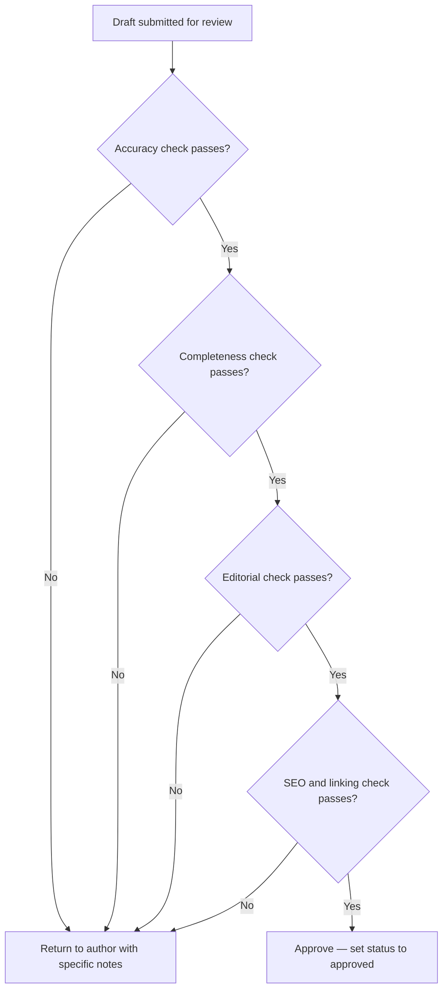

# Content Review SOP

## Purpose

Defines the review process for content before it is approved for publishing. Ensures every piece of content is accurate, complete, editorially sound, and SEO-ready before it reaches the website.

---

## Scope

Covers the review of any content draft that has been submitted for review (status: `review` in the Content Pipeline). Does not cover the creation process (SOP-CON-001) or publishing (SOP-CON-003). The reviewer is responsible for accuracy, completeness, editorial quality, and SEO — not for rewriting the content.

---

## Roles and Responsibilities

| Role | Responsibility |
|------|----------------|
| Reviewer (Jason) | Performs all review checks. Approves or returns for revision with specific feedback. |
| Content Author | Receives feedback and revises. Not involved in the review itself. |

---

## Inputs

**Trigger:** Content item moves to `review` status in the Notion Content Pipeline.

**Required before starting:**
- Draft is complete and linked in the Notion brief
- Meta title and description are present
- Word count has been checked by the author

---

## Process Steps

### Step 1: Read the brief before reading the draft
- **Who:** Reviewer
- **How:** Open the content brief in Notion. Re-read it in full before opening the draft. Know what the draft was supposed to do before assessing whether it succeeded.
- **Output:** Clear benchmark for assessment.
- **Tool:** Notion Content Pipeline

### Step 2: Accuracy review
- **Who:** Reviewer
- **How:** For each factual claim: verify it is traceable to a process doc or KB article; assess whether the confidence level of the source justifies presenting it as fact; confirm any medium-or-lower confidence claims carry the appropriate disclaimer; check that official guidance is not presented from field sources only. Flag unchecked claims with `[NEEDS SOURCE]`.
- **Output:** List of accuracy issues (or confirmation of none).
- **Tool:** GitHub (process docs, KB articles), draft

### Step 3: Completeness review
- **Who:** Reviewer
- **How:** Check against the content type definition (`content-system/content-types/[type].md`): all required sections present, word count within 10% of target, required number of internal links present.
- **Output:** List of completeness gaps (or confirmation of none).
- **Tool:** GitHub content type definitions

### Step 4: Editorial review
- **Who:** Reviewer
- **How:** Check against the style guide (`content-system/style-guide/`): tone and voice consistent; no passive voice overuse; no jargon without explanation; no vague hedging; legal disclaimers correctly worded; British English throughout.
- **Output:** List of editorial issues (or confirmation of none).
- **Tool:** Draft, GitHub style guide

### Step 5: SEO review
- **Who:** Reviewer
- **How:** Check against `content-system/rules/seo-rules.md`: meta title within 50–60 chars and includes primary keyword; meta description within 150–160 chars and includes a call to action; H1 matches or is a close variant of meta title; H2s follow logical hierarchy; primary keyword in first 100 words.
- **Output:** List of SEO issues (or confirmation of none).
- **Tool:** Draft, SEO rules

### Step 6: Internal linking review
- **Who:** Reviewer
- **How:** Check against `content-system/rules/internal-linking-rules.md`: no links to pages that do not exist; no more than one link to the same page; anchor text is descriptive (not "click here").
- **Output:** List of linking issues (or confirmation of none).
- **Tool:** Draft, internal linking rules

### Step 7: Decision
- **Who:** Reviewer
- **How:** If all quality gates pass — approve. If any gate fails — return for revision with specific, actionable notes. Do not return a draft without telling the author exactly what to fix.
- **Output:** Status updated in Notion. Author notified.
- **Tool:** Notion Content Pipeline

---

## Decision Points

---

## Outputs

- Content item status updated to `approved` (or returned to `in-production` with revision notes)
- Specific, actionable revision notes added to the Notion brief if returning

---

## Quality Gates

- [ ] All factual claims traceable to a process doc or KB article
- [ ] Disclaimers present where required (medium or lower confidence source)
- [ ] All required sections present per content type definition
- [ ] Word count within 10% of target
- [ ] Tone and voice consistent with brand guidelines
- [ ] British English throughout
- [ ] Legal disclaimers correctly worded
- [ ] Meta title: 50–60 characters, includes primary keyword
- [ ] Meta description: 150–160 characters, includes call to action
- [ ] Internal links valid, sufficient, and descriptively anchored
- [ ] No broken or placeholder links

---

## Exceptions and Escalations

**Exception:** A factual claim cannot be verified but the content would be significantly incomplete without it.
**How to handle:** Flag with `[NEEDS SOURCE]` and return to author. Do not publish content with unverified claims. If the source does not exist yet, the content waits.

**Exception:** A legal or regulatory change is identified during review that makes the draft inaccurate.
**How to handle:** Return the draft. Trigger a process doc or KB article update (SOP-RES-004 or SOP-KNW-002) before the content can be completed.

---

## Related Documents

- [Content Creation SOP](content-creation-sop.md)
- [Content Publishing SOP](content-publishing-sop.md)
- [Content Pipeline Lifecycle](../../workflows/content-pipeline/content-lifecycle.md)
- [Editorial Standards](../../content-system/style-guide/editorial-standards.md)
- [Legal Disclaimer Rules](../../content-system/style-guide/legal-disclaimer-rules.md)
- [SEO Rules](../../content-system/rules/seo-rules.md)
