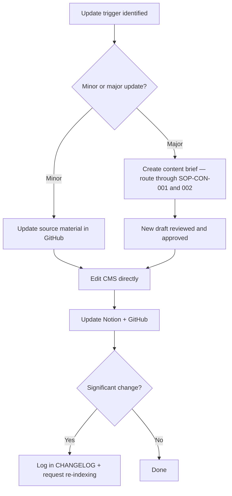

# Content Update SOP

## Purpose

Defines how to handle updates to published content — whether triggered by a scheduled review, a regulatory change, or a team or reader flag. Ensures source material is always updated before published content, and that the full review cycle is applied for major changes.

---

## Scope

Covers updates to content that is already published (status: `published` in Notion). Distinct from creating new content (SOP-CON-001). Covers both minor corrections and major rewrites. Also defines when to retire rather than update.

---

## Roles and Responsibilities

| Role | Responsibility |
|------|----------------|
| Content Owner (Jason) | Assesses scope of update, updates source material, makes content edits. |
| Reviewer (Jason) | Re-reviews content if the update is major (treat as new brief). |

---

## Inputs

**Triggers:**

| Trigger | Urgency |
|---|---|
| Regulation or process has changed | Immediate (within 48 hours) |
| Process doc has been revalidated with new information | Within 2 weeks |
| Scheduled review date reached | Per cadence in Notion |
| Team or client flags an inaccuracy | Within 48 hours |
| SEO performance has declined significantly | Within 1 month |

**Required before starting:**
- The specific change to be made is identified
- The source (process doc or KB article) that informs the change is located

---

## Process Steps

### Step 1: Assess the scope of the update
- **Who:** Content Owner
- **How:** Determine whether this is a minor update (factual correction, updated link, minor clarification — can be made directly) or a major update (structural change, new section, outdated process steps — treat as a new brief).
- **Output:** Scope classification: minor or major.
- **Tool:** Review draft and current page

### Step 2: Update the source material first
- **Who:** Content Owner
- **How:** Before editing the live page, update the source: if process information has changed, update the process doc in GitHub (`processes/[area]/[slug].md`); if a regulation has changed, update the relevant KB article in `knowledge/`. Content must always reflect the GitHub source docs. Never update published content without updating the source first.
- **Output:** Process doc or KB article updated in GitHub.
- **Tool:** GitHub

### Step 3: For major updates — create a content brief
- **Who:** Content Owner
- **How:** If the update is major, create a new content brief in Notion for the updated version. Route it through SOP-CON-001 (creation) and SOP-CON-002 (review) before replacing the live content.
- **Output:** Content brief created in Notion. New draft in progress.
- **Tool:** Notion Content Pipeline

### Step 4: Make the edits
- **Who:** Content Owner
- **How:** Edit the page in the CMS. Keep the existing URL (changing URLs breaks inbound links and SEO). For minor updates, edit directly. For major updates, follow the full creation and review cycle first.
- **Output:** Content updated on the live page.
- **Tool:** Website CMS

### Step 5: Update the "Last updated" date
- **Who:** Content Owner
- **How:** Update the displayed "Last updated" date on the published page to today's date.
- **Output:** Freshness signal updated for readers and search engines.
- **Tool:** Website CMS

### Step 6: Update Notion Content Pipeline
- **Who:** Content Owner
- **How:** For minor updates: keep status as `published` but log the update in the notes field and update the `updated` date. For major updates: set status back to `review` to route through the review process, then set to `published` once re-approved.
- **Output:** Notion record reflects current state.
- **Tool:** Notion Content Pipeline

### Step 7: Update GitHub records
- **Who:** Content Owner
- **How:** Increment the `updated` field in the relevant process doc or KB article frontmatter. Update confidence level if it has changed. Log in CHANGELOG.md if the change is significant.
- **Output:** GitHub records current.
- **Tool:** GitHub

### Step 8: Request re-indexing for major updates
- **Who:** Content Owner
- **How:** Submit the updated URL to Google Search Console for re-indexing.
- **Output:** Re-indexing requested.
- **Tool:** Google Search Console

---

## Decision Points

---

## Outputs

- Updated content live on the website
- "Last updated" date refreshed
- Notion record updated
- GitHub source doc updated
- CHANGELOG updated (if significant)
- Google Search Console re-indexing requested (if major)

---

## Quality Gates

- [ ] Source material (process doc or KB article) updated before content was changed
- [ ] Published URL unchanged
- [ ] "Last updated" date reflects today
- [ ] Notion status and notes updated
- [ ] Major updates routed through review (SOP-CON-002) before going live
- [ ] CHANGELOG updated for significant changes

---

## Exceptions and Escalations

**Exception:** A regulation changes so significantly that the content requires a complete rewrite.
**How to handle:** Retire the old content rather than update. Steps: create a new content brief for the replacement; once the replacement is published, redirect the old URL to the new one; set the old item in Notion to `archived`. Do not delete old content from Notion — keep for reference.

**Exception:** A material error is identified that could mislead clients (incorrect legal or regulatory information).
**How to handle:** Unpublish or add a prominent `⚠ This page is under review — do not rely on this information` notice immediately. Fix urgently (within 24 hours). Do not leave materially incorrect regulatory content live while working on a fix.

---

## Related Documents

- [Content Creation SOP](content-creation-sop.md)
- [Content Review SOP](content-review-sop.md)
- [Content Publishing SOP](content-publishing-sop.md)
- [Content Pipeline Lifecycle](../../workflows/content-pipeline/content-lifecycle.md)
- [Update Cadence Rules](../../content-system/rules/update-cadence-rules.md)
- [Process Revalidation SOP](../research/process-revalidation-sop.md)
