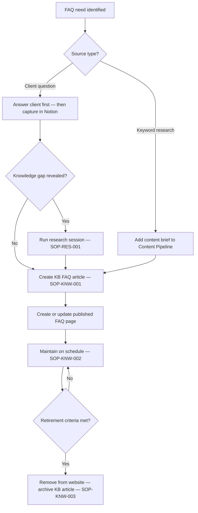

# FAQ Maintenance SOP

## Purpose

Defines how FAQ content is captured, created, maintained, and retired — both in the knowledge base (`knowledge/faqs/`) and in published website content. Ensures FAQ answers are grounded in validated sources and kept current.

---

## Scope

Covers the full FAQ lifecycle: capturing new FAQ ideas, creating FAQ entries, maintaining existing FAQs when source material changes, and retiring FAQs that are no longer relevant. Applies to both internal KB FAQ articles and published FAQ pages on the website.

---

## Roles and Responsibilities

| Role | Responsibility |
|------|----------------|
| Lead Advisor (Jason) | Identifies FAQ needs. Creates and maintains all FAQ content. |

---

## Inputs

**Triggers (new FAQ):**
- A client asks a question in an active case that is not clearly answered in existing content
- Keyword research identifies a high-volume question in the target topics
- A partner frequently encounters this question from their clients

**Triggers (update existing FAQ):**
- The related process doc has been updated
- The standard content review cadence is reached
- A client provides information that contradicts a published FAQ answer

---

## Process Steps

### Part A: Capturing New FAQ Ideas

#### Step 1: Capture from client cases
- **Who:** Lead Advisor
- **How:** When a client asks a question not clearly answered in existing content or process docs: answer the client from the best available source first; note the question in the Case notes; add a task to the Notion Content Pipeline for an FAQ entry (or add it directly to the relevant KB FAQ file). If the question revealed a knowledge gap, run a research session (SOP-RES-001) before publishing.
- **Output:** FAQ idea captured in Notion Content Pipeline or Case notes.
- **Tool:** Notion Cases database, Content Pipeline

#### Step 2: Capture from keyword research
- **Who:** Lead Advisor
- **How:** When keyword research identifies a common client question: add a content brief to the Notion Content Pipeline for an FAQ entry; research the answer from existing process docs and KB articles before writing; do not publish FAQ answers not grounded in validated sources.
- **Output:** Content brief created in Notion Content Pipeline.
- **Tool:** Notion Content Pipeline

---

### Part B: Creating a New FAQ Entry

#### Step 3: Determine where the FAQ lives
- **Who:** Lead Advisor
- **How:** Decide whether the FAQ belongs: in an existing KB FAQ article (`knowledge/faqs/`); in a new standalone KB FAQ article; or as part of a published FAQ page. Follow the content type definition at `content-types/faq-page.md` for format requirements.
- **Output:** Target location identified.
- **Tool:** GitHub `knowledge/faqs/`, content type definitions

#### Step 4: Create the KB FAQ article
- **Who:** Lead Advisor
- **How:** Follow SOP-KNW-001 to create the KB article at type `FAQ`. Key rules: question format must be one of "How do I...", "Can I...", "What is...", "How long does..." — not "FAQ about..."; answer is maximum 500 words (if more is required, it is a guide, not an FAQ); every answer must cite at least one source (KB article ID or process doc ID).
- **Output:** KB FAQ article created in `knowledge/faqs/`.
- **Tool:** GitHub `knowledge/faqs/`, SOP-KNW-001

#### Step 5: Create or update the published FAQ page
- **Who:** Lead Advisor
- **How:** If the FAQ is destined for the website: create a content brief in the Notion Content Pipeline; route through SOP-CON-001 and SOP-CON-002 before publishing. Group FAQs by topic (minimum 3 per group, maximum 12). Add FAQPage JSON-LD structured data per the `faq-entry.md` content type specification.
- **Output:** Content brief created (or existing FAQ page updated per SOP-CON-004).
- **Tool:** Notion Content Pipeline, SOP-CON-001, SOP-CON-002

---

### Part C: Maintaining Existing FAQs

#### Step 6: Update when source material changes
- **Who:** Lead Advisor
- **How:** When the process doc or KB article underlying a FAQ is updated: update the KB FAQ article to reflect the change; then update the published FAQ content per SOP-CON-004; update the "Last updated" date on the published page; re-submit for indexing if the change is significant.
- **Output:** FAQ content current and published update triggered.
- **Tool:** GitHub `knowledge/faqs/`, SOP-CON-004

#### Step 7: Review on schedule
- **Who:** Lead Advisor
- **How:** FAQ articles follow the same review cadence as other KB articles (per SOP-KNW-002). For FAQs with regulatory content: 3–6 month cycle. For evergreen FAQs: 12-month cycle.
- **Output:** FAQ reviewed and updated or confirmed current.
- **Tool:** Notion Knowledge Base (review date filter), SOP-KNW-002

---

### Part D: Retiring FAQs

#### Step 8: Assess retirement criteria
- **Who:** Lead Advisor
- **How:** Retire a FAQ when: the process it relates to no longer exists; traffic has dropped to near zero for 12+ months; a better, more comprehensive answer has been published elsewhere and the FAQ is now redundant. Do not retire simply because the answer has changed — update instead.
- **Output:** Retirement decision confirmed.
- **Tool:** Website analytics, Notion Content Pipeline

#### Step 9: Execute retirement
- **Who:** Lead Advisor
- **How:** Remove or redirect the FAQ from the published page. Update the Notion Content Pipeline record to `archived`. Archive the KB-FAQ article following SOP-KNW-003.
- **Output:** FAQ retired from website and knowledge base.
- **Tool:** CMS, Notion Content Pipeline, SOP-KNW-003

---

## Decision Points

---

## Outputs

- KB FAQ article created in `knowledge/faqs/`
- Published FAQ page created or updated on website
- Notion Content Pipeline and Knowledge Base records current
- Retired FAQs archived and removed from published pages

---

## Quality Gates

- [ ] FAQ answer grounded in a specific KB article or process doc (not written from scratch)
- [ ] Question uses the approved format ("How do I...", "Can I...", "What is...", "How long does...")
- [ ] Answer is under 500 words (if not, it is a guide)
- [ ] Source cited in KB article (KB ID or PROC ID)
- [ ] Published FAQ has FAQPage JSON-LD structured data
- [ ] Review date set in Notion Knowledge Base record
- [ ] Source material updated before FAQ content is updated

---

## Exceptions and Escalations

**Exception:** A client asks a question that requires a complex, multi-part answer exceeding 500 words.
**How to handle:** Determine whether this is genuinely an FAQ or whether it should be a guide. If the topic is broad, create a guide content brief. A short FAQ entry can link to the guide for "more detail."

**Exception:** A published FAQ contains an error identified after publishing.
**How to handle:** Follow SOP-CON-004 for the content update. Update the KB FAQ article first, then update the published content. If the error is material (incorrect regulatory or legal information), treat it as an urgent update per SOP-CON-004 Exceptions.

---

## Related Documents

- [Knowledge Article Creation SOP](knowledge-article-creation-sop.md)
- [Knowledge Review SOP](knowledge-review-sop.md)
- [Knowledge Retirement SOP](knowledge-retirement-sop.md)
- [Content Update SOP](../content/content-update-sop.md)
- [Content Creation SOP](../content/content-creation-sop.md)
- [FAQ Content Type Definition](../../content-types/faq-page.md)
