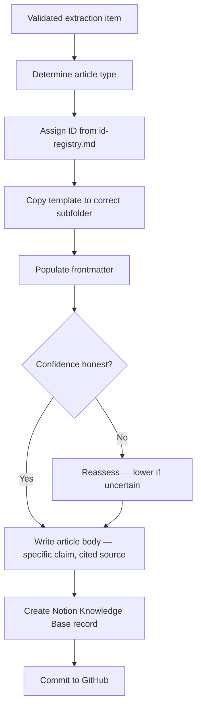

# Knowledge Article Creation SOP

## Purpose

Defines how to create a structured knowledge article in the `knowledge/` folder. Ensures every KB article has the right type, a traceable source, an honest confidence level, and a Notion record.

---

## Scope

Covers the creation of new KB articles from any source — partner interview extractions, research sessions, or direct observation. Does not cover the extraction process itself (SOP-RES-003) or the periodic review of existing articles (SOP-KNW-002).

---

## Roles and Responsibilities

| Role | Responsibility |
|------|----------------|
| Lead Advisor (Jason) | Determines article type. Creates files. Registers IDs. Creates Notion records. |

---

## Inputs

**Trigger:** Knowledge extraction (SOP-RES-003) has produced a validated item ready to be filed as a KB article.

**Required before starting:**
- Extracted item reviewed and approved (per SOP-RES-003 Step 3)
- Source is specific and traceable (not just "research session")
- Confidence level assigned

---

## Process Steps

### Step 1: Determine the article type
- **Who:** Lead Advisor
- **How:** Select the appropriate type:

| Type | Use when | Template |
|---|---|---|
| Official | Documenting official government guidance or legislation | `knowledge/_templates/official-knowledge-template.md` |
| Field | Documenting practitioner intelligence from partner interviews | `knowledge/_templates/field-knowledge-template.md` |
| FAQ | Answering a specific frequently asked client question | `knowledge/_templates/knowledge-article-template.md` |
| Decision tree | Documenting routing logic for a client scenario | `knowledge/_templates/decision-tree-template.md` |

- **Output:** Article type selected.
- **Tool:** `knowledge/_templates/`

### Step 2: Assign an ID
- **Who:** Lead Advisor
- **How:** Get the next available ID from `system/standards/id-registry.md`. ID format by type: Official → `KB-OFF-[NNN]`; Field → `KB-FLD-[NNN]`; FAQ → `KB-FAQ-[NNN]`; Decision tree → `KB-DEC-[NNN]`. Increment the counter in `id-registry.md` after assigning.
- **Output:** ID assigned and registered.
- **Tool:** `system/standards/id-registry.md`

### Step 3: Copy the template
- **Who:** Lead Advisor
- **How:** Copy the appropriate template from `knowledge/_templates/` to the correct subfolder: Official → `knowledge/official/`; Field → `knowledge/field/`; FAQ → `knowledge/faqs/`; Decision tree → `knowledge/decision-trees/`. Name the file using kebab-case: `[topic-slug]-[KB-ID].md`. Example: `meu1-real-world-processing-time-KB-FLD-001.md`.
- **Output:** Template copied and renamed.
- **Tool:** GitHub

### Step 4: Populate the frontmatter
- **Who:** Lead Advisor
- **How:** Fill in all required fields. Pay particular attention to: `confidence` — be honest; default to one level lower if uncertain; `source` — must be specific and traceable; `related_process` — link to the relevant PROC-XXX if applicable.
- **Output:** Frontmatter complete.
- **Tool:** GitHub

### Step 5: Write the article body
- **Who:** Lead Advisor
- **How:** State the knowledge claim clearly in the first paragraph. Do not hedge with vague language — if uncertain, reflect it in the confidence level rather than in the prose. Cite the source explicitly. For field articles: note the context (practitioner type, location, date). For official articles: quote the relevant passage and include the URL.
- **Output:** Article body written.
- **Tool:** GitHub

### Step 6: Create the Notion Knowledge Base record
- **Who:** Lead Advisor
- **How:** Add an entry in the Notion Knowledge Base database. Set `GitHub File Path` to the path of the new file. Set `Date Created` to today. Set `Confidence Level`, `Status`, and `Related Process` fields. Set `Next Review Due` per the review cadence: high confidence → 12 months; medium → 6 months; low → 3 months.
- **Output:** Notion Knowledge Base record created.
- **Tool:** Notion Knowledge Base database

### Step 7: Commit to GitHub
- **Who:** Lead Advisor
- **How:** Include the new file in a commit with a clear message noting the source: `Add [KB-ID]: [brief description] — from [source type]`.
- **Output:** Article committed to GitHub.
- **Tool:** GitHub

---

## Decision Points

---

## Outputs

- KB article file created in `knowledge/` with correct type, ID, and template
- ID registered in `system/standards/id-registry.md`
- Notion Knowledge Base record created with all required fields
- Article committed to GitHub

---

## Quality Gates

- [ ] Article type matches content (official / field / FAQ / decision tree)
- [ ] ID assigned and counter incremented in id-registry.md
- [ ] All required frontmatter fields populated
- [ ] Confidence level is honest (not aspirational)
- [ ] Source is specific and traceable (not just "research session")
- [ ] Body states a clear, specific claim (not vague)
- [ ] Notion Knowledge Base record created with file path and review date
- [ ] File committed to GitHub

---

## Exceptions and Escalations

**Exception:** The knowledge claim cannot be attributed to a specific source.
**How to handle:** Do not create the article. A KB article without a traceable source cannot be validated or updated. Either find the source or discard the claim.

**Exception:** The claim is a useful interim finding that cannot yet be confirmed.
**How to handle:** Create the article with `confidence: unverified` and add a clear note in the body that this is a placeholder pending validation. Set `next_review_due` to 30 days. Flag in the Notion record.

---

## Related Documents

- [Knowledge Review SOP](knowledge-review-sop.md)
- [Knowledge Retirement SOP](knowledge-retirement-sop.md)
- [Knowledge Extraction SOP](../research/knowledge-extraction-sop.md)
- [Knowledge Templates](../../knowledge/_templates/)
- [ID Registry](../../system/standards/id-registry.md)
- [Confidence Levels](../../system/taxonomies/confidence-levels.yaml)
