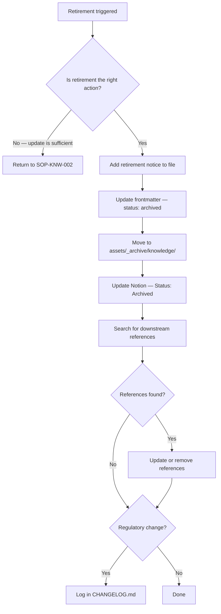

# Knowledge Retirement SOP

## Purpose

Defines how to retire a knowledge article that is no longer current or relevant. Ensures retired articles are archived (not deleted), downstream references are updated, and the retirement reason is documented.

---

## Scope

Covers the retirement of KB articles in `knowledge/`. Triggered during a knowledge review (SOP-KNW-002) when an article meets the retirement criteria, or at any time when a process it documents is abolished. Does not cover the retirement of published website content — that follows SOP-CON-004.

---

## Roles and Responsibilities

| Role | Responsibility |
|------|----------------|
| Lead Advisor (Jason) | Confirms retirement decision. Executes all retirement steps. |

---

## Inputs

**Trigger:** A KB article review (SOP-KNW-002) determines that the article should be retired, or a process the article documents is known to have been abolished.

**Retirement criteria (retire, do not update, when):**
- The process the article relates to no longer exists (e.g., a visa type has been abolished)
- The information is so fundamentally different from current reality that the article would be misleading even with updates
- The article has been fully superseded by a newer, higher-confidence article on the same topic

Do not retire articles simply because they are old. If the claim is still valid, update the review date instead.

---

## Process Steps

### Step 1: Confirm retirement is the right action
- **Who:** Lead Advisor
- **How:** Before retiring, ask: Is there any scenario in which this information is still useful (historical context, transitional arrangements)? Has it been superseded by a specific replacement article? Could it be updated rather than retired? Only proceed if retirement is genuinely the right action.
- **Output:** Retirement decision confirmed.
- **Tool:** Review SOP-KNW-002 outcome, related process docs

### Step 2: Add a retirement notice to the file
- **Who:** Lead Advisor
- **How:** Add the following comment at the top of the file, below the frontmatter:
```
<!-- RETIRED [YYYY-MM-DD]: [Reason. Reference to replacement article ID if applicable.] -->
```
- **Output:** Retirement reason documented in file.
- **Tool:** GitHub

### Step 3: Update the frontmatter
- **Who:** Lead Advisor
- **How:** Set `status` to `archived`. Update the `updated` date to today.
- **Output:** Frontmatter reflects retired status.
- **Tool:** GitHub

### Step 4: Move to the archive folder
- **Who:** Lead Advisor
- **How:** Move the file to `assets/_archive/knowledge/[original-subfolder]/`. Preserve the original filename. Do not delete the file.
- **Output:** File moved to archive.
- **Tool:** GitHub

### Step 5: Update Notion
- **Who:** Lead Advisor
- **How:** In the Notion Knowledge Base record: set `Status` to `Archived`; note the retirement reason in the Notes field; set `Last Reviewed` to today.
- **Output:** Notion Knowledge Base record updated.
- **Tool:** Notion Knowledge Base database

### Step 6: Check and update downstream references
- **Who:** Lead Advisor
- **How:** Search for the KB article ID in process docs and published content. Update any references: if a replacement article exists, update the reference to point to the new ID; if no replacement exists, remove the reference or add a note that the information is no longer available.
- **Output:** All downstream references updated.
- **Tool:** GitHub (grep for KB article ID in `processes/`), CMS, Notion Content Pipeline

### Step 7: Log in CHANGELOG if the retirement reflects a regulatory change
- **Who:** Lead Advisor
- **How:** If the retirement is because a process has been abolished or a regulation has materially changed, log it in CHANGELOG.md with the date and a brief explanation.
- **Output:** CHANGELOG updated (if applicable).
- **Tool:** GitHub CHANGELOG.md

---

## Decision Points



---

## Outputs

- KB article file moved to `assets/_archive/knowledge/` with retirement comment
- Frontmatter `status` set to `archived`
- Notion Knowledge Base record updated to `Archived`
- Downstream references updated
- CHANGELOG updated (if regulatory change)

---

## Quality Gates

- [ ] Retirement confirmed as the right action (not just due to age)
- [ ] Retirement notice added to file with date and reason
- [ ] File moved to archive — not deleted
- [ ] Notion record updated with status and reason
- [ ] Downstream references searched and updated
- [ ] CHANGELOG updated if retirement reflects a regulatory change

---

## Exceptions and Escalations

**Exception:** A retired article covers a transitional period and may still be needed for historical context (e.g., a rule that applied before a specific date).
**How to handle:** Retire as normal but note in the retirement comment and Notion record that the article covers a historical period. Keep it accessible in the archive with a clear date range in the title if needed.

**Exception:** There are multiple articles on the same topic and retirement is being used to consolidate them.
**How to handle:** Create the consolidated replacement article first. Verify it covers all claims from the articles being retired. Then retire the superseded articles, referencing the replacement in each retirement comment.

---

## Related Documents

- [Knowledge Article Creation SOP](knowledge-article-creation-sop.md)
- [Knowledge Review SOP](knowledge-review-sop.md)
- [Content Update SOP](../content/content-update-sop.md)
