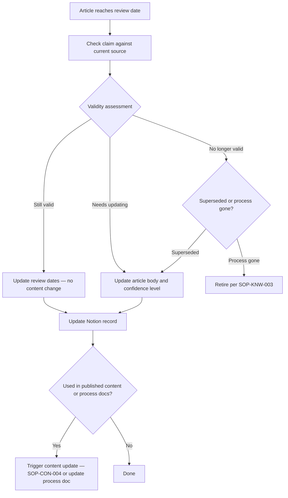

# Knowledge Review SOP

## Purpose

Defines how to review knowledge articles for continued accuracy and relevance on a scheduled cadence. Ensures the knowledge base reflects current practice and that stale or superseded articles are identified promptly.

---

## Scope

Covers the periodic review of existing KB articles in `knowledge/`. Triggered by scheduled review dates in Notion. Does not cover the initial creation of articles (SOP-KNW-001) or the retirement of articles that are no longer valid (SOP-KNW-003) — though this SOP may trigger either.

---

## Roles and Responsibilities

| Role | Responsibility |
|------|----------------|
| Lead Advisor (Jason) | Performs all review steps. Updates articles. Updates Notion records. |

---

## Inputs

**Trigger:** A KB article reaches its `Next Review Due` date in the Notion Knowledge Base database.

**Review cadence (from `system/governance/review-cadences.md`):**

| Confidence level | Review cadence |
|---|---|
| High | 12-month cycle |
| Medium | 6-month cycle |
| Low | 3-month cycle (or until resolved) |
| Unverified | 30-day cycle |

**Required before starting:**
- Notion Knowledge Base filter showing articles with `Next Review Due` ≤ today
- Access to the article's source URL or original source document

---

## Process Steps

### Step 1: Identify articles due for review
- **Who:** Lead Advisor
- **How:** In Notion Knowledge Base, filter by `Next Review Due` ≤ today. Work through the list in priority order: low-confidence articles first, then by topic area relevance to active cases.
- **Output:** Prioritised review list.
- **Tool:** Notion Knowledge Base database

### Step 2: Check whether the claim is still valid
- **Who:** Lead Advisor
- **How:** For **official** articles: navigate to the source URL; confirm the page content matches the claim; check the page's "last updated" date. For **field** articles: check whether any newer intelligence from partner interviews contradicts or updates this claim; check whether a recent research session produced conflicting information.
- **Output:** Validity assessment: still valid, needs updating, or no longer valid.
- **Tool:** Official source websites, Notion Research Log

### Step 3: Apply the appropriate outcome
- **Who:** Lead Advisor
- **How:** Based on the assessment:

| Outcome | Action |
|---|---|
| Claim still valid | Update `updated` and `last_reviewed` dates; set `next_review_due`; add validation history entry |
| Claim needs updating | Update article body; update confidence level if changed; set status to `Validated` after update |
| Claim no longer valid | If superseded: update the article; if the related process no longer exists: retire per SOP-KNW-003 |

- **Output:** Article updated or routed to retirement.
- **Tool:** GitHub `knowledge/`

### Step 4: Update Notion
- **Who:** Lead Advisor
- **How:** Update `Last Reviewed` and `Next Review Due` in the Notion Knowledge Base record. Update `Status` and `Confidence Level` if either has changed.
- **Output:** Notion record reflects current state.
- **Tool:** Notion Knowledge Base database

### Step 5: Check for downstream impact
- **Who:** Lead Advisor
- **How:** If the claim changed: is it referenced in any published content? If yes, create a content update task per SOP-CON-004. Is it referenced in a process doc? If yes, update the process doc.
- **Output:** Downstream updates triggered (if applicable).
- **Tool:** GitHub `processes/`, Notion Content Pipeline

---

## Decision Points

---

## Outputs

- KB article updated (or confirmed current) in GitHub
- `Last Reviewed` and `Next Review Due` updated in Notion
- Downstream content or process doc updates triggered (if applicable)
- Articles routed to retirement if no longer valid (SOP-KNW-003)

---

## Quality Gates

- [ ] Source checked directly (not assumed to be unchanged)
- [ ] Confidence level reassessed — not left at previous level if content changed
- [ ] `next_review_due` set to a specific date (not left blank)
- [ ] Notion record updated with new review dates
- [ ] Downstream impact checked and actioned

---

## Exceptions and Escalations

**Exception:** A source URL is no longer accessible (page removed or domain changed).
**How to handle:** Search for the equivalent current official page. If found, update the citation. If the official guidance is genuinely no longer published, downgrade confidence to `low` and add a note. Do not leave a dead-link citation.

**Exception:** An article has been reviewed multiple times but confidence remains at `low` because no corroborating source has been found.
**How to handle:** Set a priority to resolve this at the next partner interview for this topic area. If low confidence cannot be resolved after two review cycles, consider whether the article should be retired or merged into a broader article with appropriate caveats.

---

## Related Documents

- [Knowledge Article Creation SOP](knowledge-article-creation-sop.md)
- [Knowledge Retirement SOP](knowledge-retirement-sop.md)
- [Process Revalidation SOP](../research/process-revalidation-sop.md)
- [Content Update SOP](../content/content-update-sop.md)
- [Review Cadences](../../system/governance/review-cadences.md)
