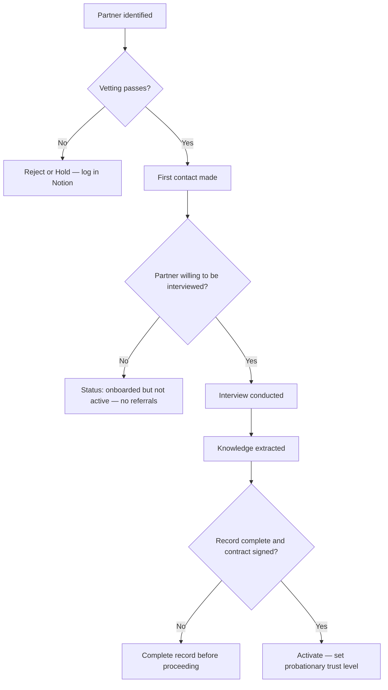

---
id: SOP-PAR-001
title: Partner Onboarding SOP
category: partners
status: active
version: 1.0
owner: jason
created: 2026-04-13
updated: 2026-04-13
review_due: 2026-10-13
related_sops:
  - SOP-PAR-002
  - SOP-PAR-003
  - SOP-PAR-004
related_workflows:
  - partner-pipeline
tags:
  - partners
  - onboarding
  - network-management
---

# Partner Onboarding SOP

## Purpose

Defines the full process for identifying, vetting, interviewing, and activating a new partner. Governs how Paphos Advisors builds its partner network to ensure quality, knowledge extraction, and documented commercial terms before any referrals are made.

---

## Scope

Covers all stages from initial partner identification through to activation as an active referral partner. Does not cover ongoing partner management (SOP-PAR-003) or referral tracking (SOP-PAR-004). The detailed checklist for each stage is at `partners/onboarding/partner-onboarding-checklist.md`.

---

## Roles and Responsibilities

| Role | Responsibility |
|------|----------------|
| Lead Advisor (Jason) | Drives all stages of onboarding. Conducts interview. Makes activation decision. |
| Partner Candidate | Provides information and participates in interview. Signs agreement before activation. |

---

## Inputs

**Trigger:** A potential partner is identified — through research, client need, referral, or proactive sourcing.

**Required before starting:**
- Partner category identified (see `partners/categories/`)
- Partner is not already in the network or previously rejected
- Basic regulatory status can be checked online

---

## Process Steps

### Step 1: Initial assessment (Stage 1)
- **Who:** Lead Advisor
- **How:** Run vetting assessment per SOP-PAR-002. Confirm regulatory compliance, online presence, market positioning, capacity, and conflict of interest. Decision: proceed, hold, or reject.
- **Output:** Vetting assessment logged in Notion Research Log.
- **Tool:** Online search, Notion Research Log

### Step 2: First contact (Stage 2)
- **Who:** Lead Advisor
- **How:** Make initial contact — email or phone. Frame the conversation around potential collaboration and knowledge exchange. Do not lead with referral volume or commercial terms. Set status to `contacted` in Notion.
- **Output:** First contact made. Partner status updated.
- **Tool:** Email, Notion Partners database

### Step 3: Information gathering (Stage 3)
- **Who:** Lead Advisor
- **How:** Collect firm details: full name, regulatory registration number, service areas, languages, geographic coverage, fee structures, and typical client profile. Use the information gathering section of the onboarding checklist.
- **Output:** Partner record partially populated in Notion.
- **Tool:** Notion Partners database, partner-onboarding-checklist.md

### Step 4: Formal interview (Stage 4)
- **Who:** Lead Advisor
- **How:** Schedule and conduct the formal knowledge interview using `partners/onboarding/onboarding-interview-guide.md`. Record using Plaud Note. Save transcript to `assets/partner-interviews/`. This stage is mandatory — partners who decline cannot proceed to active status.
- **Output:** Interview transcript saved. Partner status set to `interviewed`.
- **Tool:** Plaud Note, GitHub assets/, Notion

### Step 5: Knowledge extraction (Stage 5)
- **Who:** Lead Advisor
- **How:** Run PRMT-EXT-001 against the interview transcript. Extract KB articles. Update related process documents with field intelligence. Follow SOP-RES-003.
- **Output:** KB articles created. Process docs updated. Research Log entry updated.
- **Tool:** Claude, GitHub, Notion Research Log

### Step 6: Record completion (Stage 6)
- **Who:** Lead Advisor
- **How:** Complete the full partner record in Notion: all fields populated, regulatory registration confirmed, contract on file (mark `Contract on File: Yes`), commercial terms documented, trust level set to `probationary`.
- **Output:** Partner record complete. Contract filed.
- **Tool:** Notion Partners database

### Step 7: Activation (Stage 7)
- **Who:** Lead Advisor
- **How:** Set partner status to `active` in Notion. Set trust level to `probationary`. Set 90-day review reminder. Notify the partner they are now part of the network.
- **Output:** Partner active. 90-day review scheduled.
- **Tool:** Notion Partners database

---

## Decision Points

---

## Outputs

- Partner record created and fully populated in Notion Partners database
- Interview transcript saved in GitHub assets/partner-interviews/
- KB articles created from interview intelligence
- Process documents updated with field notes
- Contract on file
- Partner activated at probationary trust level
- 90-day review reminder set

---

## Quality Gates

- [ ] Regulatory compliance verified (licence number confirmed)
- [ ] No conflict of interest identified
- [ ] Formal interview conducted and recorded
- [ ] Knowledge extraction completed (at least one KB article created)
- [ ] All required Notion fields populated
- [ ] Contract on file — `Contract on File` marked Yes in Notion
- [ ] Trust level set to `probationary`
- [ ] 90-day review reminder set

---

## Exceptions and Escalations

**Exception:** Partner declines the formal interview.
**How to handle:** Partner may be onboarded (record completed, contract signed) but must not be set to `active` status. They remain at `onboarded` and cannot receive referrals. Revisit after 3 months.

**Exception:** Partner's regulatory status cannot be verified online.
**How to handle:** Request proof of registration directly. Do not proceed to activation until registration is confirmed. If they cannot provide it, do not activate.

**Exception:** Commercial terms are disputed or not agreed.
**How to handle:** Do not activate until terms are in writing and signed. A handshake arrangement is not sufficient.

---

## Governing Principles

- **Quality over quantity.** A poor referral damages client trust more than having no referral.
- **Knowledge extraction is mandatory.** The interview is the primary mechanism for acquiring field intelligence.
- **Trust levels are earned.** All partners start at probationary. They move to trusted after 90 days, 2+ positive referral outcomes, and a satisfactory review.
- **Commercial terms must be documented.** No activation without a signed agreement.
- **Partners are not clients.** Our obligation is to our clients first.

---

## Related Documents

- [Partner Vetting SOP](partner-vetting-sop.md)
- [Partner Review SOP](partner-review-sop.md)
- [Referral Tracking SOP](referral-tracking-sop.md)
- [Partner Onboarding Checklist](../../partners/onboarding/partner-onboarding-checklist.md)
- [Vetting Criteria](../../partners/onboarding/vetting-criteria.md)
- [Onboarding Interview Guide](../../partners/onboarding/onboarding-interview-guide.md)
- [Partner Pipeline Lifecycle](../../workflows/partner-pipeline/partner-lifecycle.md)
