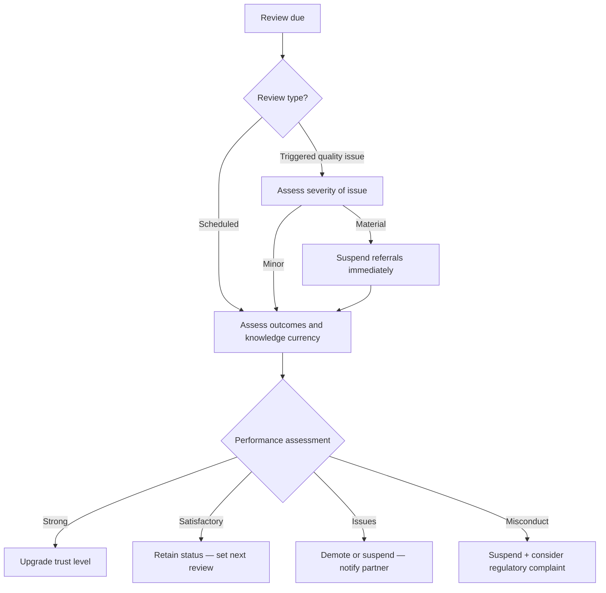

# Partner Review SOP

## Purpose

Defines the process for reviewing active partners on a scheduled cadence to maintain quality standards and ensure trust levels remain appropriate. Also covers triggered reviews when a client raises a quality issue.

---

## Scope

Covers scheduled reviews (90-day probationary, annual trusted) and triggered reviews (quality issue raised). Does not cover the initial onboarding process (SOP-PAR-001) or day-to-day referral tracking (SOP-PAR-004).

---

## Roles and Responsibilities

| Role | Responsibility |
|------|----------------|
| Lead Advisor (Jason) | Performs all review steps. Makes trust level decisions. Communicates with partner. |
| Partner | Not directly involved in the review. Notified of any status changes before they take effect. |

---

## Inputs

**Triggers:**
- Probationary partners: 90 days after activation (reminder set at activation)
- Trusted partners: annual review (set when last review completed)
- Triggered review: any time a client raises a quality concern about a referred partner

**Required before starting:**
- Partner record accessible in Notion Partners database
- Case notes from the review period available
- Referral outcomes for the period known

---

## Process Steps

### Step 1: Pull the partner record from Notion
- **Who:** Lead Advisor
- **How:** Review: number of referrals made in the review period; client outcomes where known; any complaints or issues logged; last interview date and whether a refresh interview is warranted.
- **Output:** Baseline understanding of partner performance in the review period.
- **Tool:** Notion Partners database, Case records

### Step 2: Assess client outcomes
- **Who:** Lead Advisor
- **How:** For each referral in the review period: did clients report positive experiences; were there delays, miscommunications, or quality failures; did the partner communicate proactively or did we have to chase.
- **Output:** Client outcome assessment notes.
- **Tool:** Notion Case records

### Step 3: Assess knowledge currency
- **Who:** Lead Advisor
- **How:** Has the partner's practice area had regulatory changes since the last interview; if yes, is their guidance still current; consider whether a refresh interview is warranted.
- **Output:** Knowledge currency assessment.
- **Tool:** Process docs, recent research sessions

### Step 4: Assess commercial relationship
- **Who:** Lead Advisor
- **How:** Have referrals been reciprocated (if that was part of the arrangement); are commercial terms still appropriate and documented.
- **Output:** Commercial relationship assessment.
- **Tool:** Partner record, contract on file

### Step 5: Trust level decision
- **Who:** Lead Advisor
- **How:** Based on all assessments, determine the outcome:

| Outcome | Action |
|---|---|
| Strong performance, probationary | Upgrade to `trusted` |
| Satisfactory, no issues | Retain current trust level |
| Minor issues, first occurrence | Flag in notes, retain status, discuss with partner |
| Recurring issues or quality failure | Demote to `probationary` or `suspended` |
| Regulatory issue or client harm | Immediately set to `suspended`, escalate |

- **Output:** Trust level decision made.
- **Tool:** Assessment from previous steps

### Step 6: Update Notion
- **Who:** Lead Advisor
- **How:** Update trust level if changed. Log the review date and outcome in the Notes field. Set next review date (90 days for probationary, 12 months for trusted).
- **Output:** Notion record updated.
- **Tool:** Notion Partners database

### Step 7: Partner communication
- **Who:** Lead Advisor
- **How:** For any status change, communicate with the partner directly before the change takes effect. Never demote a partner silently. For upgrades: communicate positively and reinforce the relationship.
- **Output:** Partner notified of outcome.
- **Tool:** Email

---

## Decision Points

---

## Outputs

- Trust level updated in Notion (if changed)
- Review date and outcome logged in partner Notes field
- Next review date set
- Partner notified of any status change

---

## Quality Gates

- [ ] All referrals from the review period assessed
- [ ] Client outcomes checked (not just assumed positive)
- [ ] Knowledge currency assessed for relevant regulatory area
- [ ] Trust level decision documented with reasoning
- [ ] Partner notified before any demotion takes effect
- [ ] Next review date set in Notion

---

## Exceptions and Escalations

**Exception:** A client raises a quality concern that constitutes potential misconduct (wrong advice causing client harm, regulatory breach).
**How to handle:** Immediately suspend referrals to the partner (do not wait for a full review). Investigate within 5 business days. If misconduct is confirmed: remove the partner and consider whether a regulatory complaint to the relevant professional body is appropriate. Log everything in Notion.

**Exception:** Partner cannot be reached for a scheduled review communication.
**How to handle:** Attempt contact twice over 2 weeks. If no response: retain current status but log the failed contact. If the pattern repeats at the next review: downgrade to probationary pending contact.

---

## Related Documents

- [Partner Onboarding SOP](partner-onboarding-sop.md)
- [Referral Tracking SOP](referral-tracking-sop.md)
- [Partner Pipeline Lifecycle](../../workflows/partner-pipeline/partner-lifecycle.md)
- [Referral Pipeline Lifecycle](../../workflows/referral-pipeline/referral-lifecycle.md)
