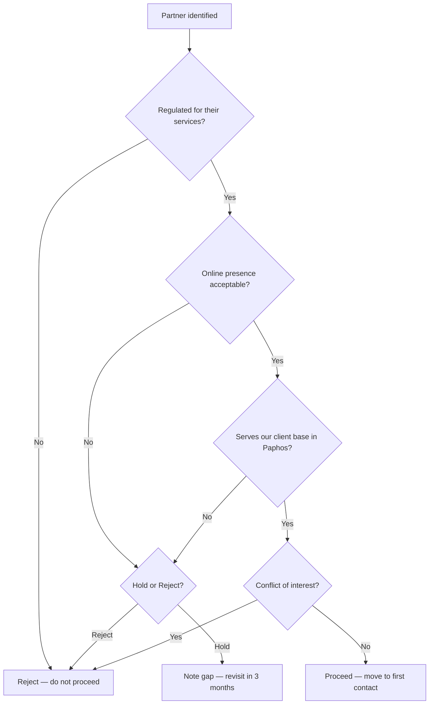

# Partner Vetting SOP

## Purpose

Defines how to assess whether a potential partner meets the criteria to join the Paphos Advisors partner network. Ensures that only regulated, qualified, and conflict-free partners are advanced for onboarding.

---

## Scope

Covers the initial vetting assessment performed before first contact is made with a potential partner. Full vetting criteria are in `partners/onboarding/vetting-criteria.md`. Does not cover the full onboarding process (SOP-PAR-001) or ongoing partner review (SOP-PAR-003).

---

## Roles and Responsibilities

| Role | Responsibility |
|------|----------------|
| Lead Advisor (Jason) | Performs all vetting steps. Makes the proceed/hold/reject decision. |

---

## Inputs

**Trigger:** A potential partner has been identified (through research, client need, or sourcing).

**Required before starting:**
- Partner name and firm name identified
- Partner's claimed service area and regulatory category known
- No prior rejection record in Notion

---

## Process Steps

### Step 1: Regulatory compliance check
- **Who:** Lead Advisor
- **How:** Before any other assessment, verify the partner is regulated for the services they provide. For lawyers: confirm Cyprus Bar Association registration. For tax advisors: confirm ICPAC registration. For property agents: confirm CREAA registration. For financial advisors: confirm CySEC authorisation.
- **Output:** Regulatory status confirmed or unconfirmed.
- **Tool:** Relevant professional body registry websites

### Step 2: Online presence review
- **Who:** Lead Advisor
- **How:** Check: professional website exists and is current; Google / LinkedIn reviews and what they say; any regulatory complaints or negative press; listed practice area is consistent with what we need.
- **Output:** Online presence assessment notes.
- **Tool:** Google, LinkedIn, professional body websites

### Step 3: Market positioning assessment
- **Who:** Lead Advisor
- **How:** Assess: do they work with expatriates and international clients; do they operate in Paphos (or relevant geography); are their fee levels appropriate for our client segments.
- **Output:** Market positioning assessment notes.
- **Tool:** Website review, online research

### Step 4: Capacity check
- **Who:** Lead Advisor
- **How:** Assess: sole practitioner or firm; can they absorb additional client load; track record of timely service from reviews or direct intel.
- **Output:** Capacity assessment notes.
- **Tool:** Website, reviews

### Step 5: Conflict of interest check
- **Who:** Lead Advisor
- **How:** Assess: do they have a competing advisory offering that conflicts with ours; are they already a partner of a direct competitor.
- **Output:** Conflict of interest confirmed or cleared.
- **Tool:** Website review, market knowledge

### Step 6: Initial quality assessment
- **Who:** Lead Advisor
- **How:** From publicly available information: does their guidance (website, LinkedIn articles) appear accurate and up to date; do they cite current regulations and correct procedure.
- **Output:** Quality assessment notes.
- **Tool:** Website, published articles

### Step 7: Decision
- **Who:** Lead Advisor
- **How:** Based on all checks, make one of three decisions: Proceed (meets criteria — move to first contact, Stage 2 of onboarding); Hold (has potential but gaps — note the gap and revisit in 3 months); Reject (fails regulatory compliance, quality, or conflict of interest — log rejection reason).
- **Output:** Decision recorded. Notion Research Log entry created.
- **Tool:** Notion Research Log

---

## Decision Points

---

## Outputs

- Vetting assessment logged in Notion Research Log with type `Partner Research`
- Decision recorded: proceed / hold / reject
- If proceed: partner status set to `candidate` in Notion Partners database
- If hold: reminder set for 3-month revisit
- If reject: rejection reason logged

---

## Quality Gates

- [ ] Regulatory registration confirmed from official source (not self-reported only)
- [ ] No active complaints or regulatory issues identified
- [ ] No conflict of interest with Paphos Advisors service offering
- [ ] Serves expatriate / international clients in Paphos area
- [ ] Decision (proceed / hold / reject) logged in Notion with reason

---

## Exceptions and Escalations

**Exception:** Regulatory register is not accessible online (e.g., older firm not listed on digital registry).
**How to handle:** Request proof of registration directly from the partner as part of first contact. Do not assume registration. Do not proceed to activation without confirmation.

**Exception:** Partner has historical complaints that were resolved satisfactorily.
**How to handle:** Note the historical issue in the vetting record. Proceed with extra scrutiny during the interview. Set a shorter review cycle (e.g., 60-day rather than 90-day probationary review).

---

## Related Documents

- [Partner Onboarding SOP](partner-onboarding-sop.md)
- [Vetting Criteria](../../partners/onboarding/vetting-criteria.md)
- [Partner Pipeline Lifecycle](../../workflows/partner-pipeline/partner-lifecycle.md)
- [Partner Categories](../../partners/categories/)
