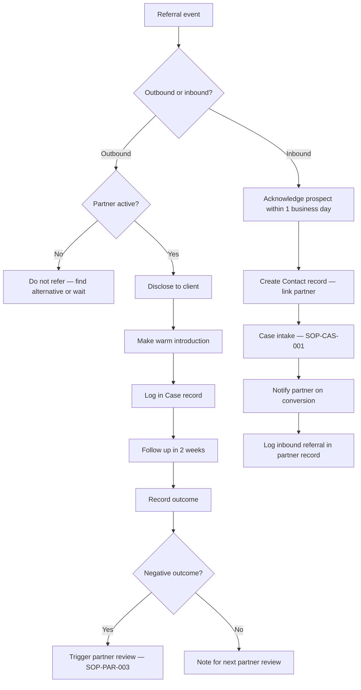

# Referral Tracking SOP

## Purpose

Defines how to record, track, and close the loop on partner referrals — both outbound (Paphos Advisors referring a client to a partner) and inbound (a partner referring a client to us). Ensures every referral is logged, disclosed correctly, and followed up.

---

## Scope

Covers outbound and inbound referral events from the moment a referral decision is made through to outcome recording. Does not cover the onboarding of new partners (SOP-PAR-001) or the periodic review of partner performance (SOP-PAR-003).

---

## Roles and Responsibilities

| Role | Responsibility |
|------|----------------|
| Lead Advisor (Jason) | Makes all referral decisions. Logs all referrals. Follows up on outcomes. |
| Partner | Receives or sends referrals. Not involved in our internal tracking. |

---

## Inputs

**Triggers:**
- A client has a need that falls within a partner's service area (outbound referral)
- A partner contacts us with a referred prospect (inbound referral)

**Required before starting (outbound):**
- Partner is `active` status in Notion (not probationary, suspended, or archived)
- Client's need has been confirmed as falling within the partner's service area
- Disclosure requirements reviewed (`partners/referral-rules/referral-disclosure-requirements.md`)

**Required before starting (inbound):**
- Referring partner is identified and linked in Notion

---

## Process Steps

### Outbound Referrals (We Refer a Client to a Partner)

#### Step 1: Identify the right partner
- **Who:** Lead Advisor
- **How:** Use the routing logic in `partners/referral-rules/referral-routing-logic.md`. Confirm the partner is `active` and appropriate for this client's ICP segment. Do not refer to a probationary partner without additional care.
- **Output:** Partner selected.
- **Tool:** Notion Partners database, referral-routing-logic.md

#### Step 2: Disclose to the client
- **Who:** Lead Advisor
- **How:** Before making the introduction, inform the client that you are making a referral and explain the nature of any commercial relationship with the partner. Follow the disclosure script in `partners/referral-rules/referral-disclosure-requirements.md`.
- **Output:** Disclosure confirmed.
- **Tool:** Email or phone

#### Step 3: Make the introduction
- **Who:** Lead Advisor
- **How:** Send a warm email introduction. Include the client's first name and a brief description of what they need. Do not simply hand over a phone number. Do not include confidential case details without client consent.
- **Output:** Introduction sent.
- **Tool:** Email

#### Step 4: Log in Notion
- **Who:** Lead Advisor
- **How:** In the client's Case record, add the partner to `Partners Referred To` and note the referral date in Case Notes.
- **Output:** Referral logged.
- **Tool:** Notion Cases database

#### Step 5: Follow up with the client
- **Who:** Lead Advisor
- **How:** After 2 weeks, check in with the client to confirm the referral was received and that they are proceeding. If the referral did not connect, assess whether a second attempt or alternative partner is needed.
- **Output:** Follow-up outcome noted in Case record.
- **Tool:** Email, Notion

#### Step 6: Record the outcome
- **Who:** Lead Advisor
- **How:** Once the client has completed (or discontinued) their engagement with the partner, record the outcome in the Case notes. If outcome was positive: flag for the partner's next review. If outcome was negative: trigger a partner review per SOP-PAR-003.
- **Output:** Outcome recorded. Partner review triggered if needed.
- **Tool:** Notion Cases database

---

### Inbound Referrals (A Partner Refers a Client to Us)

#### Step 7: Acknowledge receipt
- **Who:** Lead Advisor
- **How:** Contact the referred prospect within 1 business day. Acknowledge the referral and set expectations for next steps.
- **Output:** Prospect contacted.
- **Tool:** Email or phone

#### Step 8: Create a Contact record
- **Who:** Lead Advisor
- **How:** Create a Contact record in the Notion Contacts database. Set `How They Found Us` to `Referral — Partner`. Link the referring partner in the `Referred By` field.
- **Output:** Contact record created.
- **Tool:** Notion Contacts database

#### Step 9: Proceed through case intake
- **Who:** Lead Advisor
- **How:** Follow SOP-CAS-001 for the full intake process from this point.
- **Output:** Case intake underway.
- **Tool:** Notion Cases database, SOP-CAS-001

#### Step 10: Notify the referring partner
- **Who:** Lead Advisor
- **How:** Once the client has confirmed engagement (Case status: `Active`), let the referring partner know their referral converted. This is a courtesy that strengthens the relationship.
- **Output:** Partner notified.
- **Tool:** Email

#### Step 11: Track for reciprocity
- **Who:** Lead Advisor
- **How:** Note the inbound referral in the partner's Notion record so it is visible during their next scheduled review.
- **Output:** Inbound referral recorded in partner record.
- **Tool:** Notion Partners database

---

## Decision Points

---

## Outputs

- Outbound: referral logged in Case record with date and outcome
- Inbound: Contact record created with referring partner linked, inbound referral noted in partner record
- Negative outcomes: partner review triggered (SOP-PAR-003)

---

## Quality Gates

- [ ] Outbound referral: partner confirmed as `active` before introduction made
- [ ] Outbound referral: disclosure made to client before introduction
- [ ] Outbound referral: warm introduction sent (not just a phone number passed)
- [ ] All referrals logged in Notion Case record on the day they are made
- [ ] Inbound referral: prospect contacted within 1 business day
- [ ] Inbound referral: referring partner linked in Contact record
- [ ] Outcomes recorded when known (do not leave referrals without a recorded result)

---

## Exceptions and Escalations

**Exception:** Partner is `probationary` status but the client genuinely needs their services and no alternative exists.
**How to handle:** Proceed with the referral but note it explicitly. Monitor the outcome closely. Do not use probationary partners as a default — only where no trusted alternative is available.

**Exception:** Client declines the referral after disclosure.
**How to handle:** Respect the decision. Note in Case record. Do not pressure the client to use a specific partner. Find an alternative if the need remains.

**Exception:** Inbound referral from a partner who is not yet in our network.
**How to handle:** Accept the referral on its merits. Create a Contact record. Separately, assess whether the referring professional should be added to the partner network (run SOP-PAR-001 if appropriate).

---

## Related Documents

- [Partner Onboarding SOP](partner-onboarding-sop.md)
- [Partner Review SOP](partner-review-sop.md)
- [Case Intake SOP](../cases/case-intake-sop.md)
- [Referral Disclosure Requirements](../../partners/referral-rules/referral-disclosure-requirements.md)
- [Referral Routing Logic](../../partners/referral-rules/referral-routing-logic.md)
- [Partner Pipeline Lifecycle](../../workflows/partner-pipeline/partner-lifecycle.md)
