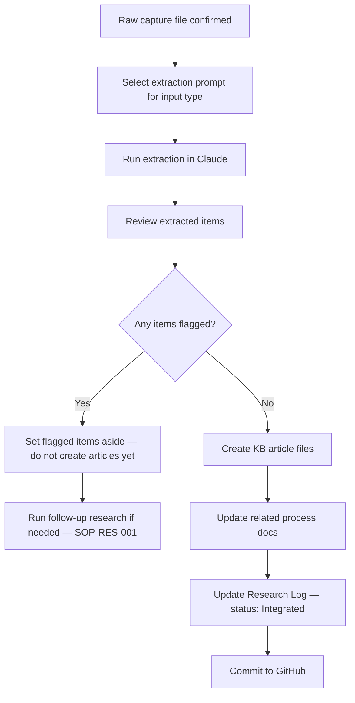

# Knowledge Extraction SOP

## Purpose

Defines how to extract structured knowledge from raw inputs (partner interview transcripts, research captures, official documents) and integrate it into the knowledge base. Ensures extracted knowledge is validated, filed correctly, and linked to relevant process documents.

---

## Scope

Covers the extraction and integration of knowledge from any raw input that has already been captured per SOP-RES-001. Begins after a raw file exists in `assets/`. Ends when KB articles are created and process docs are updated. New KB article creation follows the article creation standards in SOP-KNW-001.

---

## Roles and Responsibilities

| Role | Responsibility |
|------|----------------|
| Lead Advisor (Jason) | Runs all extraction sessions. Reviews outputs. Creates KB articles. Updates process docs. |

---

## Inputs

**Trigger:** A raw capture file exists in `assets/transcripts/` or `assets/research-captures/` with a Research Log entry at `Captured` status.

**Input types and extraction prompts:**

| Input type | Extraction prompt |
|---|---|
| Partner interview transcript | `prompts/extraction/interview-extraction-prompt.md` (PROMPT-EXT-001) |
| Official document or PDF | `prompts/extraction/document-extraction-prompt.md` (PROMPT-EXT-002) |
| Perplexity research session | `prompts/extraction/research-session-extraction-prompt.md` (PROMPT-EXT-003) |

**Required before starting:**
- Raw file confirmed present in `assets/`
- Research Log entry exists at `Captured` status

---

## Process Steps

### Step 1: Confirm the raw input is captured
- **Who:** Lead Advisor
- **How:** Verify the raw file exists in `assets/transcripts/` or `assets/research-captures/`. Do not begin extraction from memory or notes — always work from the saved file.
- **Output:** Capture file location confirmed.
- **Tool:** GitHub `assets/`

### Step 2: Run the extraction prompt
- **Who:** Lead Advisor
- **How:** Open Claude. Paste the appropriate extraction prompt followed by the full raw input text. Run the extraction. The output will be a structured set of KB article drafts with confidence levels and source attributions.
- **Output:** Extraction output produced.
- **Tool:** Claude, extraction prompts from `prompts/extraction/`

### Step 3: Review the extracted output before creating files
- **Who:** Lead Advisor
- **How:** Before creating any files, review each extracted item: Are the claims specific and actionable? Is the confidence level appropriately assigned (not inflated)? Are there contradictions with existing process docs? Are there claims that seem implausible or require further validation? Flag any issues before proceeding.
- **Output:** Extraction reviewed. Items approved, flagged, or set aside.
- **Tool:** GitHub process docs, Notion Knowledge Base

### Step 4: Create KB article files
- **Who:** Lead Advisor
- **How:** For each validated extraction item, use the appropriate template from `knowledge/_templates/`. Assign an ID from `system/standards/id-registry.md`. Save to the correct subfolder in `knowledge/` (official, field, faqs, decision-trees). Populate all required frontmatter fields per SOP-KNW-001.
- **Output:** KB article files created in GitHub.
- **Tool:** GitHub `knowledge/`, `system/standards/id-registry.md`

### Step 5: Update related process documents
- **Who:** Lead Advisor
- **How:** For each extracted item that relates to an existing process doc: open the relevant process doc in `processes/`; add or update the `field_notes` section with the new intelligence; update the `confidence` level if the new intelligence changes it; update the `updated` date in the frontmatter.
- **Output:** Process docs updated with new field intelligence.
- **Tool:** GitHub `processes/`

### Step 6: Update the Research Log in Notion
- **Who:** Lead Advisor
- **How:** Set the session status to `Integrated`. Record how many KB articles were created. Note which process docs were updated. Close any open questions that were resolved by this session.
- **Output:** Research Log entry updated to `Integrated`.
- **Tool:** Notion Research Log

### Step 7: Commit to GitHub
- **Who:** Lead Advisor
- **How:** Commit all new KB articles and updated process docs in a single commit with a clear message following the convention: `Add KB articles from [source type] — [topic area]`. Example: `Add KB articles from immigration lawyer interview — MEU1 process`.
- **Output:** Changes committed.
- **Tool:** GitHub

---

## Decision Points

---

## Outputs

- KB articles created in `knowledge/` with IDs registered
- Process documents updated with new field notes and updated confidence levels
- Research Log entry updated to `Integrated`
- Changes committed to GitHub

---

## Quality Gates

- [ ] Extraction run from saved raw file (not from memory)
- [ ] Each extracted item reviewed before a KB article was created
- [ ] No KB article created with `unverified` confidence unless explicitly a placeholder
- [ ] Every KB article has a traceable source (interview date + category, or URL + retrieval date)
- [ ] Related process docs updated
- [ ] Research Log updated to `Integrated`
- [ ] Contradictions with existing docs flagged in `field_notes` (not silently overwritten)

---

## Exceptions and Escalations

**Exception:** An extraction reveals a direct contradiction with an existing process doc (e.g., a partner says step X is no longer required, but the process doc says it is mandatory).
**How to handle:** Do not silently update the process doc. Add a `field_notes` entry noting both versions and the date of the new intelligence. Flag the contradiction for resolution — either through a follow-up research session, a second partner consultation, or an official source check. Only update the process doc once the contradiction is resolved.

**Exception:** Extracted items are vague or non-specific (e.g., "processing times vary").
**How to handle:** Do not create KB articles from vague claims. Either run a targeted follow-up session to get specifics, or discard the item. Vague KB articles do not serve clients or advisors.

---

## Related Documents

- [Research Capture SOP](research-capture-sop.md)
- [Source Validation SOP](source-validation-sop.md)
- [Knowledge Article Creation SOP](../knowledge/knowledge-article-creation-sop.md)
- [Extraction Prompts](../../prompts/extraction/)
- [Knowledge Templates](../../knowledge/_templates/)
- [ID Registry](../../system/standards/id-registry.md)
