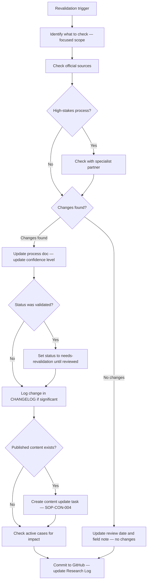

# Process Revalidation SOP

## Purpose

Defines how to revalidate a process document when it reaches its `review_due` date, when a regulatory change is suspected, or when a case reveals a discrepancy between the documented process and current practice. Ensures process docs remain current and trustworthy.

---

## Scope

Covers the full revalidation cycle for process documents stored in `processes/`. Triggered by scheduled review dates, regulatory announcements, partner intelligence, or case-driven discrepancies. Does not cover the initial creation of process docs or the update of published website content — that follows SOP-CON-004.

---

## Roles and Responsibilities

| Role | Responsibility |
|------|----------------|
| Lead Advisor (Jason) | Conducts all revalidation activity. Updates process docs. Notifies relevant parties. |
| Specialist Partners | Consulted for field intelligence on high-stakes processes. |

---

## Inputs

**Triggers:**
- A process doc reaches its `review_due` date
- A regulatory change is announced (budget, legislation update, government announcement)
- A partner flags that a process has changed
- A client case reveals a discrepancy between the doc and current practice
- A research session contradicts existing process doc content

**Required before starting:**
- Process doc located in GitHub `processes/`
- Previous validation date and open questions from last review known

---

## Process Steps

### Step 1: Identify what needs checking
- **Who:** Lead Advisor
- **How:** Before running any research, review the process doc and identify: which specific steps or facts are most likely to have changed since the last review; what the open questions were from the last review; whether any partner has recently mentioned changes in this area. Focus the research on these points first.
- **Output:** Focused checklist of what to verify.
- **Tool:** GitHub process doc, Notion Research Log (previous session)

### Step 2: Check official sources first
- **Who:** Lead Advisor
- **How:** Navigate to the official sources listed in the process doc. Check: has the page content changed; is there a new version of the relevant legislation or guidance; has the government announced any changes. Use `prompts/research/regulatory-update-check-prompt.md` to structure this check in Perplexity if needed.
- **Output:** Official source check completed. Changes noted or confirmed unchanged.
- **Tool:** Official source websites, Perplexity (using regulatory-update-check-prompt)

### Step 3: Check with partners (for high-stakes processes)
- **Who:** Lead Advisor
- **How:** For immigration, tax, and property processes where field intelligence is critical, contact the relevant specialist partner(s) with a targeted question: "Have you seen any changes to [process] recently?" or "Is [specific step] still working the same way?" This is lighter than a full interview — a 10-minute conversation or email exchange is sufficient.
- **Output:** Partner check completed. Field intelligence noted.
- **Tool:** Email, phone

### Step 4: Update the process doc
- **Who:** Lead Advisor
- **How:** Based on the checks above, apply one of two outcomes:

**No changes found:**
- Update the `updated` field in frontmatter to today
- Update `review_due` to the next review date
- Add a field note: `[date] — Revalidation check complete. No changes found. [source].`

**Changes found:**
- Update all affected sections in the process doc
- Update `field_notes` to explain what changed and when
- Reassess and update the `confidence` level
- If status was `validated`, set it to `needs-revalidation` until the full update is reviewed
- Log the change in CHANGELOG.md if significant
- **Output:** Process doc updated or confirmed current.
- **Tool:** GitHub process docs, CHANGELOG.md

### Step 5: Update published content
- **Who:** Lead Advisor
- **How:** If there is published website content derived from this process doc, review the content for accuracy against the updated doc. If content is now inaccurate, create a content update task in the Notion Content Pipeline and follow SOP-CON-004.
- **Output:** Content update task created (if needed).
- **Tool:** Notion Content Pipeline, SOP-CON-004

### Step 6: Notify the team of changes affecting active cases
- **Who:** Lead Advisor
- **How:** If the change affects advice being given to any active cases, notify the assigned advisors immediately. Do not wait for the next scheduled case review.
- **Output:** Active cases notified of change (if applicable).
- **Tool:** Notion Cases database, email

### Step 7: Commit and log
- **Who:** Lead Advisor
- **How:** Commit the updated process doc to GitHub with a clear message. Update the Research Log entry to `Integrated`. Set `review_due` for the next scheduled review cycle.
- **Output:** Changes committed. Research Log updated.
- **Tool:** GitHub, Notion Research Log

---

## Decision Points

---

## Outputs

- Process doc updated in GitHub (or confirmed current with updated dates)
- `review_due` set for next scheduled revalidation
- CHANGELOG updated (if significant change)
- Content update task created in Notion (if published content is affected)
- Active cases notified (if process change affects current advice)

---

## Quality Gates

- [ ] Official sources checked before updating process doc content
- [ ] Partner check conducted for immigration, tax, and property processes
- [ ] Changes documented in `field_notes` with date and source
- [ ] Confidence level reassessed (not left at previous level if claims changed)
- [ ] `review_due` updated in frontmatter
- [ ] Published content reviewed for accuracy against updated doc
- [ ] Active cases notified if change affects current advice

---

## Exceptions and Escalations

**Exception:** A regulatory change is announced that materially affects an active client.
**How to handle:** Update the process doc immediately (within 24 hours). Set status to `needs-revalidation`. Notify affected active cases the same day. Do not wait for the full revalidation cycle — flag and advise on the change now; complete the full revalidation within 1 week.

**Exception:** A partner provides field intelligence that directly contradicts the official source.
**How to handle:** Record both versions in `field_notes`. Do not update the process doc to reflect the field claim until a second partner or additional source corroborates it. Assign `medium` confidence and add a flag for priority follow-up at the next review.

---

## Related Documents

- [Research Capture SOP](research-capture-sop.md)
- [Source Validation SOP](source-validation-sop.md)
- [Knowledge Extraction SOP](knowledge-extraction-sop.md)
- [Content Update SOP](../content/content-update-sop.md)
- [Process Template](../../processes/_templates/process-template.md)
- [Regulatory Monitoring Framework](../../research/frameworks/regulatory-monitoring-framework.md)
