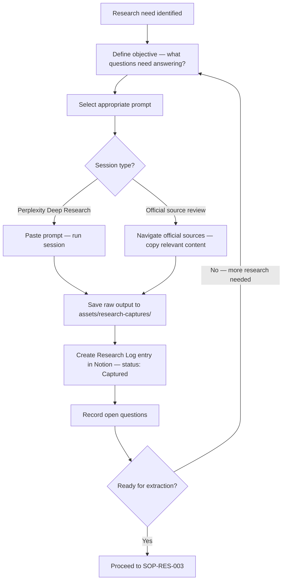

# Research Capture SOP

## Purpose

Defines how to conduct and capture a research session so that the output is traceable, usable for knowledge extraction, and properly logged. Ensures raw outputs are saved before any extraction or analysis begins.

---

## Scope

Covers all structured research activity: Perplexity Deep Research sessions, official source reviews, and any other formal research input to the knowledge base. Ends when the raw output is saved and a Research Log entry is created. Knowledge extraction from the captured output follows SOP-RES-003.

---

## Roles and Responsibilities

| Role | Responsibility |
|------|----------------|
| Lead Advisor (Jason) | Conducts all research sessions. Saves all outputs. Creates Research Log entries. |

---

## Inputs

**Triggers:**
- A process doc has reached its `review_due` date
- A regulatory change has been announced
- A case reveals a knowledge gap (flagged per SOP-CAS-003)
- A content brief requires source material before writing

**Required before starting:**
- Research objective clearly defined (topic, questions to answer, intended output)
- Relevant prompt selected from `prompts/research/`

---

## Process Steps

### Step 1: Define the research objective
- **Who:** Lead Advisor
- **How:** Before opening any research tool, write down: what process or topic is being researched; what specific questions need to be answered; what the output will be used for (update a process doc, create a new one, validate an existing one, inform a content brief). This prevents scope creep and ensures the output is usable.
- **Output:** Research objective written down.
- **Tool:** Research Log entry (Notion) or notes

### Step 2: Select the right prompt
- **Who:** Lead Advisor
- **How:** Choose from `prompts/research/`: `process-research-prompt.md` (PROMPT-RES-001) for researching a Cyprus administrative process; `source-discovery-prompt.md` for finding reliable sources on a topic; `regulatory-update-check-prompt.md` for checking whether a process has changed; `competitor-content-audit-prompt.md` for content strategy research.
- **Output:** Prompt selected.
- **Tool:** GitHub prompts/research/

### Step 3: Run the research session
- **Who:** Lead Advisor
- **How:** For Perplexity Deep Research: paste the prompt; fill in the [PROCESS NAME] and [SPECIFIC QUESTIONS] variables; run the session. For official source review: navigate to the relevant official sources (see `research/sources/official-sources-cyprus.md`); screenshot or copy the relevant sections; note the URL and retrieval date.
- **Output:** Research session completed.
- **Tool:** Perplexity (Deep Research mode), official source websites

### Step 4: Export and save the raw output
- **Who:** Lead Advisor
- **How:** Save the raw output to `assets/research-captures/` using the naming convention: `[topic-slug]-research-[YYYY-MM-DD].md`. Include the date and tool used at the top of the file. Do not edit or summarise the raw output — save it in full.
- **Output:** Raw capture file saved in GitHub.
- **Tool:** GitHub `assets/research-captures/`

### Step 5: Create a Research Log entry in Notion
- **Who:** Lead Advisor
- **How:** Immediately after saving the capture file, create a new entry in the Notion Research Log: set status to `Captured`; record the capture file path; note the tool and prompt used; note the initial confidence assessment; add any open questions the session raised but did not resolve.
- **Output:** Research Log entry created at `Captured` status.
- **Tool:** Notion Research Log

### Step 6: Flag open questions
- **Who:** Lead Advisor
- **How:** Before closing the session, note any questions the research raised but did not resolve. Add these to the Research Log entry as `Open Questions`. These become inputs to follow-up sessions.
- **Output:** Open questions recorded in Research Log.
- **Tool:** Notion Research Log

---

## Decision Points

---

## Outputs

- Raw capture file saved in `assets/research-captures/`
- Research Log entry created in Notion at `Captured` status
- Open questions recorded

---

## Quality Gates

- [ ] Research objective defined before the session started
- [ ] Raw output saved in full (not summarised or edited)
- [ ] File named per convention: `[topic-slug]-research-[YYYY-MM-DD].md`
- [ ] Research Log entry created in Notion with file path recorded
- [ ] Open questions noted before session closed
- [ ] Session not marked as ready for extraction if contradictions are unresolved

---

## Exceptions and Escalations

**Exception:** A research session produces contradictory information between sources.
**How to handle:** Do not pick the version that fits. Note the contradiction explicitly in the capture file and in the Research Log open questions. Do not extract knowledge until the contradiction is resolved — either through a follow-up session or a partner consultation.

**Exception:** Official source website is unavailable or has changed structure.
**How to handle:** Try alternative official sources in the same domain (e.g., a different government ministry page). Note the source issue in the Research Log. Do not substitute an unofficial source for a missing official one — flag the gap instead.

---

## Related Documents

- [Source Validation SOP](source-validation-sop.md)
- [Knowledge Extraction SOP](knowledge-extraction-sop.md)
- [Process Revalidation SOP](process-revalidation-sop.md)
- [Official Sources — Cyprus](../../research/sources/official-sources-cyprus.md)
- [Research Prompts](../../prompts/research/)
