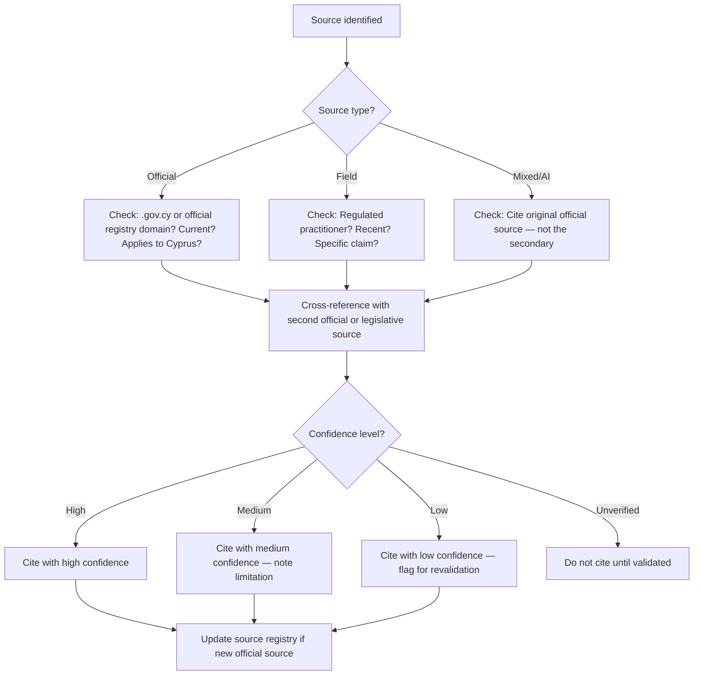

# Source Validation SOP

## Purpose

Defines how to assess whether a source is reliable enough to be cited in process documents or knowledge articles. Ensures confidence levels are assigned honestly and that sources are correctly classified before knowledge is extracted.

---

## Scope

Covers the validation of any source that will be cited in a GitHub process doc or knowledge article. Applies to official sources, field sources (partner intelligence), and research session outputs. Does not cover the full knowledge extraction process — that follows SOP-RES-003.

---

## Roles and Responsibilities

| Role | Responsibility |
|------|----------------|
| Lead Advisor (Jason) | Performs all source validation steps. Assigns confidence levels. Updates the source registry. |

---

## Inputs

**Trigger:** A source has been identified in a research capture or partner interview that will be cited in a process doc or KB article.

**Required before starting:**
- Source identified (URL, document, or practitioner claim)
- Full validation checklist at `research/validation/source-validation-checklist.md` available

---

## Process Steps

### Step 1: Identify the source type
- **Who:** Lead Advisor
- **How:** Classify the source as one of: Official (government website, legislation, official guidance document); Field (partner interview, practitioner observation); Mixed (combination of official and field, or secondary source citing official guidance). Source type determines which validation questions apply.
- **Output:** Source type classified.
- **Tool:** `research/validation/source-validation-checklist.md`

### Step 2: Apply the validation checklist
- **Who:** Lead Advisor
- **How:** Work through `research/validation/source-validation-checklist.md`. Key questions: Is the source current — when was it last updated? Is it authoritative for the specific claim? Does it apply to Cyprus, not another jurisdiction? For official sources: is the URL from a `.gov.cy` or official registry domain? For field sources: is the source a regulated practitioner in the relevant field?
- **Output:** Validation checklist completed. Issues noted.
- **Tool:** `research/validation/source-validation-checklist.md`

### Step 3: Cross-reference the claim
- **Who:** Lead Advisor
- **How:** Where possible, corroborate claims with at least one additional independent source. Official claim → cross-reference with legislation or a second official page. Field claim → cross-reference with another practitioner or official source. AI / research session output → always cross-reference with at least one official or field source before citing.
- **Output:** Cross-reference completed and result noted.
- **Tool:** Official source websites, partner network

### Step 4: Assign a confidence level
- **Who:** Lead Advisor
- **How:** Based on the validation outcome, assign a confidence level: **High** — official source confirmed, current, corroborated by a second source; **Medium** — reliable source but not officially confirmed, or single field source without cross-reference; **Low** — source has concerns (may be outdated, single uncorroborated field source, or AI-only without verification); **Unverified** — not yet validated. Be honest — confidence levels must reflect actual certainty, not aspiration.
- **Output:** Confidence level assigned.
- **Tool:** `system/taxonomies/confidence-levels.yaml`

### Step 5: Update the source registry
- **Who:** Lead Advisor
- **How:** If the source is a reusable official source not already listed, add it to `research/sources/official-sources-cyprus.md`. If it is a field source, ensure it is referenced in the KB article with sufficient detail (practitioner category, location, date of intelligence).
- **Output:** Source registry updated if applicable.
- **Tool:** GitHub `research/sources/official-sources-cyprus.md`

### Step 6: Cite correctly in the target document
- **Who:** Lead Advisor
- **How:** When adding the source to a process doc or KB article, follow `system/standards/source-citation-standards.md`. Include the URL and retrieval date for online sources. Include the interview date and practitioner category for field sources.
- **Output:** Source cited correctly in document.
- **Tool:** GitHub process docs, `system/standards/source-citation-standards.md`

---

## Decision Points

---

## Outputs

- Confidence level assigned to the source
- Source registry updated (if new official source)
- Source correctly cited in the target document with confidence level noted

---

## Quality Gates

- [ ] Source type classified (official / field / mixed)
- [ ] Validation checklist completed
- [ ] Cross-reference attempted (note result even if no second source found)
- [ ] Confidence level assigned — honest, not optimistic
- [ ] Official source registry updated if applicable
- [ ] Citation format correct per source-citation-standards.md

---

## Exceptions and Escalations

**Exception:** Two sources give different answers on the same procedural fact.
**How to handle:** Prefer official sources over field sources for procedural facts. Prefer more recent sources over older. Note the conflict explicitly in the process doc `field_notes`. Do not silently choose one version — flag the uncertainty with an appropriate confidence level. If the conflict is material, consult a specialist partner before publishing.

**Exception:** Regulatory register is not accessible online (e.g., an older firm not on a digital registry).
**How to handle:** Request proof of registration directly. Do not assume the practitioner is registered. Do not assign `high` confidence until registration is confirmed.

---

## Related Documents

- [Research Capture SOP](research-capture-sop.md)
- [Knowledge Extraction SOP](knowledge-extraction-sop.md)
- [Source Validation Checklist](../../research/validation/source-validation-checklist.md)
- [Official Sources — Cyprus](../../research/sources/official-sources-cyprus.md)
- [Source Citation Standards](../../system/standards/source-citation-standards.md)
- [Confidence Levels](../../system/taxonomies/confidence-levels.yaml)
